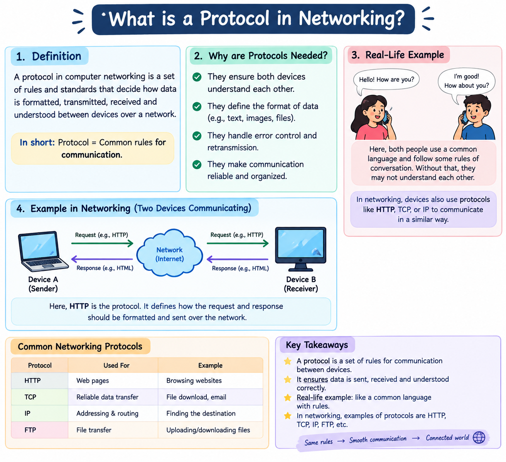
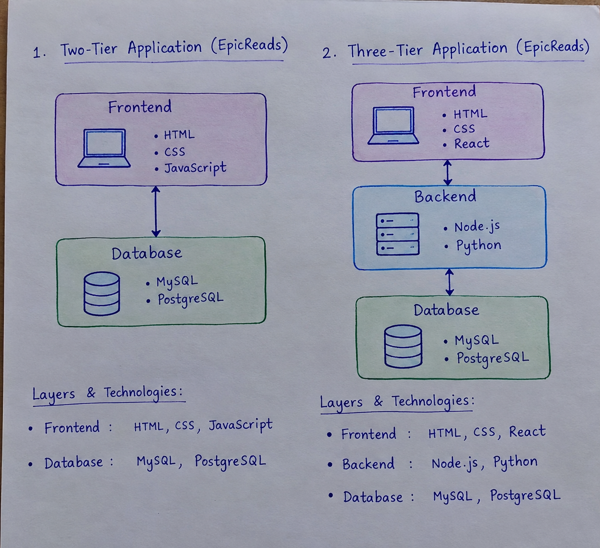
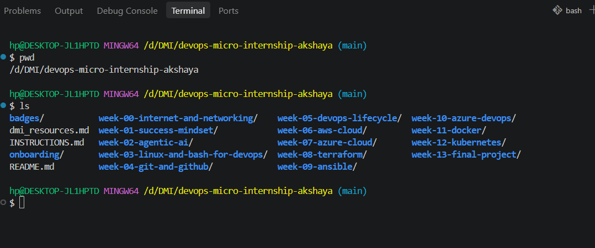

# Week 00 - Internet and Networking

Part of the DevOps Micro Internship (DMI) with Agentic AI

---

# 🧑‍💻 Task 1: Using ChatGPT as Your Learning Assistant

## Scenario

You're new to DevOps and will frequently encounter technical questions. ChatGPT can be your learning companion.

## Your Task

Write a clear ChatGPT prompt to help you understand:

> "What is a protocol in networking? Explain with a simple real-life example."

Take a screenshot of your interaction showing:

* Your detailed prompt (with clear expectations)
* ChatGPT's simplified response with an example

## Screenshot

Save your screenshot in the `screenshots` folder and update the file name below.




Replace `task-1-chatgpt.png` with your actual screenshot file name.

---

## What I Learned (2–3 lines)

I learned that a "protocol is a set of rules" that helps network devices communicate with each other.  
I also learned how protocols work using a simple real-life example, like sending a message to a friend.

---

# 🌐 Task 2: Internet and Networking

## Scenario

Your friend is launching an online bookstore named **EpicReads**.

He asked you to explain how users globally can access his website hosted in Finland.

## Your Task

Write a short explanation (**100–150 words**) that includes:

* Packet Switching
* IP Address
* TCP/IP
* HTTP/HTTPS

💡 **Tip:** You may use ChatGPT (as demonstrated in Task 1) to refine your explanation.

## Answer

### Answer (100–150 words)

When a user anywhere in the world opens the **EpicReads** website hosted in Finland, several networking processes happen. First, the website is identified using its **IP address**, which tells the network where the server is located. The user's request is divided into small units called **packets**. Using **packet switching**, these packets travel through different networks and routers to reach the EpicReads server in Finland. **TCP/IP** is the main communication protocol suite that manages addressing, routing, and reliable delivery of these packets. Once the request reaches the server, **HTTP/HTTPS** is used for communication between the user's browser and the website. HTTPS provides secure and encrypted communication. The server then sends the requested webpage back as packets, which travel through the network and are reassembled by the user's device. Thus, users globally can access EpicReads reliably and securely.

---

# 🏗️ Task 3: Application Architecture & Stack

## Scenario

EpicReads bookstore has two application versions:

### Two-Tier Application

* Frontend
* Database

### Three-Tier Application

* Frontend
* Backend
* Database

## Your Task

* Draw simple diagrams (hand-drawn or tool-based such as draw.io)
* Label each layer clearly
* List at least two common technologies or tools used for each layer
* Submit a screenshot or photo clearly showing your own drawing

## Diagram Screenshot / Photo

Save your diagram image in the `screenshots` folder and update the file name below.




Replace `task-3-diagram.png` with your actual diagram file name.

---

## Technologies Used

### Frontend

* HTML, CSS, JavaScript
* HTML, CSS / React

### Backend

* Node.js, Python
* Node.js, Python

### Database

* MySQL, PostgreSQL
* MySQL, PostgreSQL

---

# 🌍 Task 4: Domain Name & DNS (Basic Concepts)

## Scenario

Your friend's bookstore **EpicReads** is currently accessible through:

```text
52.172.142.222:3000
```

He purchased the domain:

```text
epicreads.com
```

## Your Task

In **50–100 words**, explain in your own words:

1. What is DNS (Domain Name System)?
2. Which DNS record type should be used to connect the domain to the given IP, and why?

## Answer

**DNS (Domain Name System)** is like the **phonebook of the Internet**. It converts an easy-to-remember domain name, such as **epicreads.com**, into an IP address that computers can understand.  

To connect **epicreads.com** to **52.172.142.222**, an **A (Address) record** should be used because an A record maps a domain name to an **IPv4 address**. When a user enters `epicreads.com`, DNS finds the A record and returns `52.172.142.222`. The `:3000` part is a **port number**, not part of the DNS A record.

---

# 💻 Task 5: Visual Studio Code Setup (Hands-on)

## Your Task

Install Visual Studio Code (if not already installed).

Take a screenshot of your VS Code environment showing:

* Terminal open inside VS Code
* Running a basic command:

### Windows

```powershell
dir
```

### Linux / macOS

```bash
pwd
ls
```

* Your selected VS Code theme clearly visible

⚠️ **Important:** The screenshot must show your username or another identifiable detail to confirm it is your environment.

## Screenshot

Save your screenshot in the `screenshots` folder and update the file name below.




Replace `task-5-vscode.png` with your actual screenshot file name.

---

# 🔗 Task 6: Publish Your Assignment as a LinkedIn Post

## Objective

Publishing on LinkedIn helps you:

* Build your professional online presence
* Reinforce your learning
* Document your DevOps journey publicly

## Your Task

Summarize your answers from Tasks 1–5 into a LinkedIn post.

Clearly structure your post into the following sections:

* ChatGPT
* Internet & Networking
* App Architecture
* DNS
* VS Code Setup

Use the credit note that matches your track:

Add the following credit note at the end of your post **(If you are DMI Cohort 3 student)**:

> **P.S. This post is part of the DevOps Micro Internship (DMI) with Agentic AI — Cohort 3 — by Pravin Mishra. My graded progress is public: https://dmi.pravinmishra.com/s/YOUR-GITHUB-USERNAME.html · Start your DevOps journey: https://dmi.pravinmishra.com/?utm_source=student&utm_medium=ps-linkedin&utm_campaign=cohort3**

**Tag [Pravin Mishra](https://www.linkedin.com/in/pravin-mishra-aws-trainer/) in your LinkedIn post, then tag Lead Co-Mentor — [Anjana Muthunayake](https://www.linkedin.com/in/anjana-muthunayake/).**

Add the following credit note at the end of your post **(If you are DMI Self-paced track student)**:

> **P.S. This post is part of the DevOps Micro Internship (DMI) — Self-Paced Engineer Track — by Pravin Mishra. My graded progress is public: https://dmi.pravinmishra.com/s/YOUR-GITHUB-USERNAME.html · Start your DevOps journey: https://dmi.pravinmishra.com/?utm_source=student&utm_medium=ps-linkedin&utm_campaign=self-paced**

Add the following credit note at the end of your post **(If you are DMI Campus student)**:

> **P.S. This post is part of the DevOps Micro Internship (DMI) — Campus — by Pravin Mishra. My graded progress is public: https://dmi.pravinmishra.com/s/YOUR-GITHUB-USERNAME.html · Start your DevOps journey: https://dmi.pravinmishra.com/?utm_source=student&utm_medium=ps-linkedin&utm_campaign=campus**

**Tag [Pravin Mishra](https://www.linkedin.com/in/pravin-mishra-aws-trainer/) in your LinkedIn post, then tag Lead Co-Mentor — [Anjana Muthunayake](https://www.linkedin.com/in/anjana-muthunayake/).**

Hashtags:

#DMIByPravinMishra #AgenticAI #DevOps

Replace `YOUR-GITHUB-USERNAME` with your GitHub username — that link is your public DMI progress page (your graded badge page).
---

## LinkedIn Post URL

Paste your LinkedIn post URL here:

```text
https://www.linkedin.com/posts/akshaya-bheemanathi-8618a2423_dmibypravinmishra-agenticai-devops-activity-7505145961980207104-yn9s?utm_source=share&utm_medium=member_desktop&rcm=ACoAAGtzzEkBOYmQK2WIK_NOclE5XNXW4ISP3qk
```

---

## LinkedIn Post Backup Copy

Paste the full text of your LinkedIn post here:

🚀 My DMI Week 0 Learning Journey|Internet & Networking
I’m excited to begin my DevOps Micro Internship (DMI) with Agentic AI journey! 💻🌐
As a B.Tech 3rd-year Computer Science Engineering student, I’m using this opportunity to strengthen my technical foundation, explore DevOps concepts, and gain practical knowledge through hands-on tasks.
Here’s what I worked on 👇
🤖 ChatGPT
I learned how to create clear and effective prompts to get better explanations from AI. I also understood how ChatGPT can help simplify technical concepts by providing real-life examples and beginner-friendly explanations.
🌐 Internet & Networking
I learned the basics of how the Internet works behind the scenes. I explored networking protocols, packet switching, IP addresses, and TCP/IP.
I understood that when a user accesses a website hosted in another country, data is divided into packets and travels through different networks and routers before reaching the destination.
🏗️ App Architecture
I learned about Two-Tier and Three-Tier Application Architecture.
In Two-Tier Architecture, the Frontend communicates directly with the Database.
In Three-Tier Architecture, the application is divided into Frontend, Backend, and Database, making the system more organized, scalable, and easier to maintain.
🌍 DNS
I learned about the Domain Name System (DNS) and how it works like the Internet's phonebook.
Instead of remembering an IP address such as 52.172.142.222, users can access a website using an easy domain name such as epicreads.com.
I also learned about the A record, which connects a domain name to an IPv4 address.
💻 VS Code Setup
I set up and explored Visual Studio Code and learned how to use the integrated terminal. I practiced basic terminal commands and became more comfortable with my development environment.
📚 Key Takeaways
This week helped me understand that DevOps is not only about tools but also about understanding how applications, networks, servers, and users connect together.
I’m looking forward to learning more about Linux, Git & GitHub, cloud computing, CI/CD, Docker, and other DevOps technologies in the upcoming weeks. 🚀
This is just the beginning of my learning journey, and I’m excited to learn → practice → build → improve step by step. 🌱
P.S. This post is part of the DevOps Micro Internship (DMI) with Agentic AI — Cohort 3 — by Pravin Mishra. 
My graded progress is public:[**https://lnkd.in/dPVEsRzA) **·
 Start your DevOps journey:** [**https://lnkd.in/dpCPmvrp)
Pravin Mishra,Lead Co-Mentor-Anjana Muthunayake

hashtag#DMIByPravinMishra hashtag#AgenticAI hashtag#DevOps hashtag#DevOpsJourney hashtag#ComputerScience hashtag#BTechCSE hashtag#LearningJourney hashtag#Networking hashtag#GitHub hashtag#VSCode hashtag#Technology hashtag#StudentDeveloper


---

# Reflection – Week 0

### What did you find easy?

I found it easy to understand basic networking concepts and create simple diagrams. I also enjoyed exploring GitHub and VS Code.

---

### What was difficult?

I found GitHub tasks and some networking concepts a little difficult at first, but I understood them better with practice.

---

### What will you improve next week?

Next week, I will improve my GitHub skills, practice more technical concepts, and try to complete tasks more independently.

---

## 📌 About DMI & CloudAdvisory

DevOps Micro Internship (DMI) is a project-based DevOps program run by Pravin Mishra (The CloudAdvisory) focused on real-world execution, systems thinking, and career readiness.

It helps learners build strong DevOps foundations with hands-on experience.


## 📌 Resources

- 🌐 **DMI Official Website:** https://dmi.pravinmishra.com?utm_source=github&utm_medium=readme  
- 🎓 **University:** https://university.pravinmishra.com?utm_source=github&utm_medium=readme  
- 💬 **Discord Community:** https://discord.pravinmishra.com?utm_source=github&utm_medium=readme  
- 📝 **Blog:** https://dmi.pravinmishra.com/blog?utm_source=github&utm_medium=readme  
- ▶️ **YouTube Playlist (DMI Cohort 3):** https://www.youtube.com/playlist?list=PLFeSNDtI4Cho  
- 🔗 **Pravin Mishra (LinkedIn):** https://www.linkedin.com/in/pravin-mishra-aws-trainer/  
- 🏢 **CloudAdvisory (LinkedIn):** https://www.linkedin.com/company/thecloudadvisory/

---

*This submission is part of DevOps Micro Internship (DMI) — Agentic AI Track*