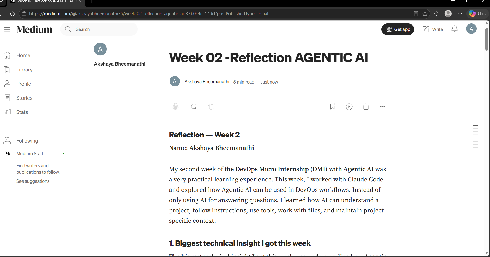
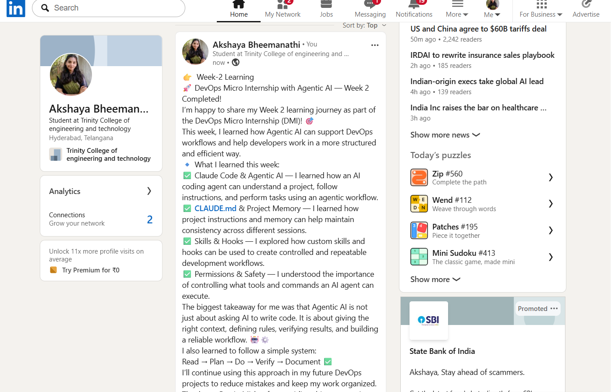

# Assignment 8 — Week 2 Reflection Blog

Part of the DevOps Micro Internship (DMI) with Agentic AI

---

# Purpose

In this assignment, you will reflect on your Week 2 learning journey and write a short blog capturing your experience working with Agentic AI tools such as Claude Code, Skills, Subagents, MCP, Hooks, Permissions, and Memory.

You will also publish a LinkedIn post summarizing your learning and share both links for evaluation.

---

# Task 1 — Write Your Reflection Blog

## Goal

Write a reflection blog covering your Week 2 learning experience.

### Blog Requirements

Your blog must include:

* Title: **Reflection – Week 2**
* Minimum 300 words
* At least 2–3 topics from Week 2 (Claude Code, Skills, Subagents, MCP, Hooks, Permissions, Memory)
* Honest personal reflection (learning, challenges, mindset)
* One habit/system you plan to implement
* Your full name clearly visible

### Allowed Platforms

You can publish your blog on:

* Hashnode
* Medium
* Dev.to
* LinkedIn Article
* GitHub Markdown file
* Substack

---

### Evidence

#### Screenshot 1 — Blog published and visible



---

### Submission Field

Blog Link:

https://medium.com/@akshayabheemanathi75/week-02-reflection-agentic-ai-37b0c4c514dd?sharedUserId=akshayabheemanathi75

---

# Task 2 — Create LinkedIn Post

## Goal

Share your Week 2 learning publicly on LinkedIn.

---

### Evidence

#### Screenshot 2 — LinkedIn post published



---

### Submission Field

LinkedIn Post Content (copy-paste here):

```
👉  Week-2 Learning
🚀 DevOps Micro Internship with Agentic AI — Week 2 Completed!
I’m happy to share my Week 2 learning journey as part of the DevOps Micro Internship (DMI)! 🎯
This week, I learned how Agentic AI can support DevOps workflows and help developers work in a more structured and efficient way.
🔹 What I learned this week:
✅ Claude Code & Agentic AI — I learned how an AI coding agent can understand a project, follow instructions, and perform tasks using an agentic workflow.
✅ CLAUDE.md & Project Memory — I learned how project instructions and memory can help maintain consistency across different sessions.
✅ Skills & Hooks — I explored how custom skills and hooks can be used to create controlled and repeatable development workflows.
✅ Permissions & Safety — I understood the importance of controlling what tools and commands an AI agent can execute.
The biggest takeaway for me was that Agentic AI is not just about asking AI to write code. It is about giving the right context, defining rules, verifying results, and building a reliable workflow. 🤖⚙️
I also learned to follow a simple system:
Read → Plan → Do → Verify → Document ✅
I’ll continue using this approach in my future DevOps projects to reduce mistakes and keep my work organized.
Thank you Pravin Mishra for providing this opportunity to learn DevOps with Agentic AI. 🙌
P.S. This post is part of the DevOps Micro Internship (DMI) — Self-Paced Engineer Track — by Pravin Mishra. My graded progress is public: https://lnkd.in/dZtUyfDs
Start your DevOps journey: https://lnkd.in/dkiFgTsp
#DMIByPravinMishra #AgenticAI #ClaudeCode #DevOps
@Pravin Mishra 👨‍💻
```

---

### LinkedIn Post Link:

https://lnkd.in/p/dHwQ2T27

---

# Submission Instructions

* Blog must be publicly accessible
* LinkedIn post must be visible (public or unlisted where applicable)
* All required fields must be filled
* Screenshot proofs must be added to GitHub repository
* Do not include sensitive information in blog or post

---

# Completion Checklist

* [✅] Blog written with required structure
* [✅] Blog includes at least 2–3 Week 2 topics
* [✅] Blog is publicly accessible
* [✅] LinkedIn post created
* [✅] Required P.S. line included
* [✅] LinkedIn post content copied in submission field
* [✅] Blog link added
* [✅] LinkedIn post link added
* [✅] Screenshots added to GitHub repo

---

# About DMI & CloudAdvisory

DevOps Micro Internship (DMI) is a project-based DevOps program run by Pravin Mishra (The CloudAdvisory), focused on real-world execution, systems thinking, and agentic AI workflows.

It helps learners build strong DevOps foundations through hands-on experience.

---

# Resources

* 🌐 DMI Official Website: [https://dmi.pravinmishra.com?utm_source=github&utm_medium=readme](https://dmi.pravinmishra.com?utm_source=github&utm_medium=readme)
* 🎓 University: [https://university.pravinmishra.com?utm_source=github&utm_medium=readme](https://university.pravinmishra.com?utm_source=github&utm_medium=readme)
* 💬 Discord Community: [https://discord.pravinmishra.com?utm_source=github&utm_medium=readme](https://discord.pravinmishra.com?utm_source=github&utm_medium=readme)
* 📝 Blog: [https://dmi.pravinmishra.com/blog?utm_source=github&utm_medium=readme](https://dmi.pravinmishra.com/blog?utm_source=github&utm_medium=readme)
* ▶️ YouTube Playlist: [https://www.youtube.com/playlist?list=PLFeSNDtI4Cho](https://www.youtube.com/playlist?list=PLFeSNDtI4Cho)
* 🔗 Pravin Mishra (LinkedIn): [https://www.linkedin.com/in/pravin-mishra-aws-trainer/](https://www.linkedin.com/in/pravin-mishra-aws-trainer/)
* 🏢 CloudAdvisory (LinkedIn): [https://www.linkedin.com/company/thecloudadvisory/](https://www.linkedin.com/company/thecloudadvisory/)
---

*This submission is part of DevOps Micro Internship (DMI) — Agentic AI Track.*
