# Assignment 3 — Production Maintenance Drill (OPS Checklist)

Part of the DevOps Micro Internship (DMI) with Agentic AI

---

## Purpose

In this assignment, you will treat your already deployed React application (on Ubuntu VM with Nginx) as a live production system. You will perform structured operational checks covering network validation, service health, log analysis, resource monitoring, configuration verification, and incident simulation with recovery — mirroring real on-call DevOps responsibilities.

---

# Task 1 — Server Access & Networking Validation

## Goal

Verify that the deployed React application is reachable from the browser and confirm basic network connectivity of the Ubuntu VM.

### Evidence

#### Screenshot 1 — Browser showing the React app with your Full Name visible on the UI

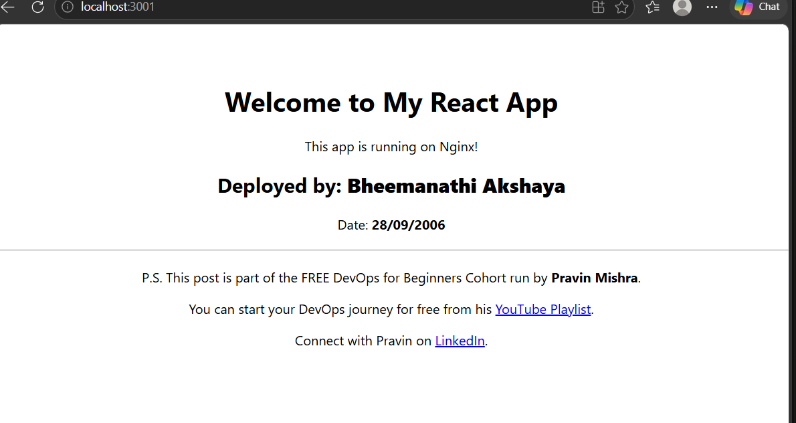

---

#### Screenshot 2 — Output of `ip a`

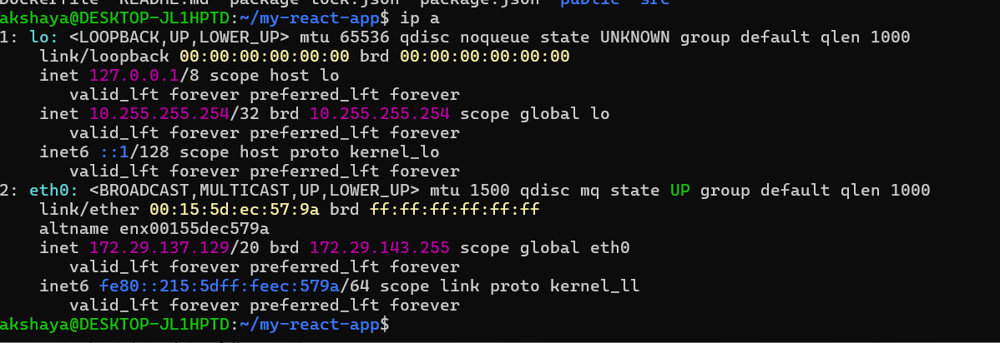

---

#### Screenshot 3 — Output of `sudo ss -tulpen`

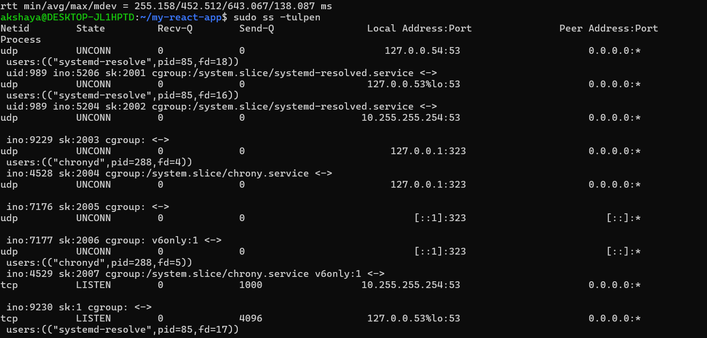

---

#### Screenshot 4 — Output of `sudo ufw status`

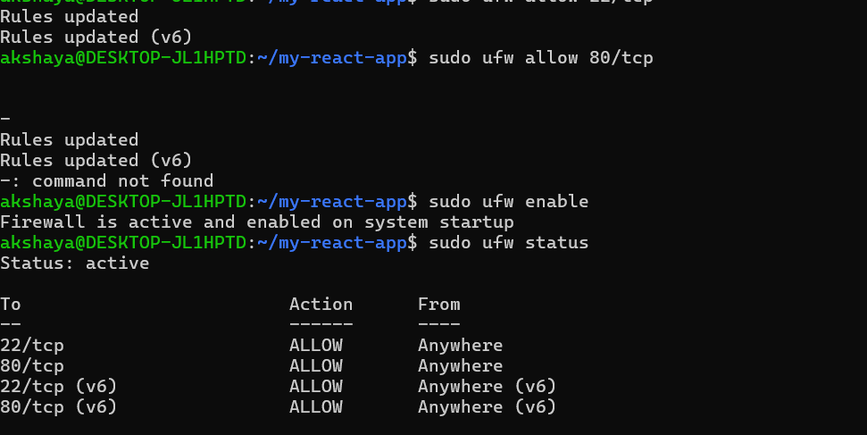

---

### Notes

Answer the following in your own words:

**1. What proves Nginx is listening on 0.0.0.0:80?**

The output of sudo ss -tulpen shows 0.0.0.0:80 in the LISTEN state, with Nginx listed as the process. This proves that Nginx is listening on port 80 on all IPv4 network interfaces.

---

**2. What proves SSH is active on port 22?**

The output of sudo ss -tulpen does not show port 22 in the LISTEN state. Also, the SSH service was not found when I checked it. Therefore, I could not confirm that SSH is active on port 22.

---

**3. Did you find any unexpected open ports? Explain briefly.**

I did not find any clearly unexpected open ports. Port 53 was listening for DNS resolution, and port 323 was used by the Chrony time synchronization service. These appear to be normal system services. Nginx was listening on port 80 as expected.

---

# Task 2 — Service Health & Systemd Validation (Nginx)

## Goal

Verify that Nginx is properly installed, running, enabled at boot, and safely configured.

### Evidence

#### Screenshot 1 — Output of `systemctl status nginx --no-pager`

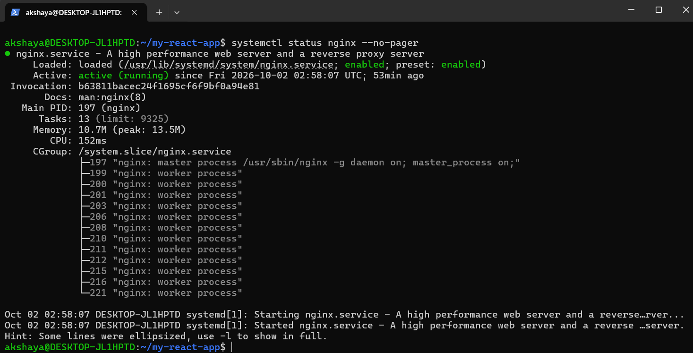

---

#### Screenshot 2 — Output of `sudo nginx -t`

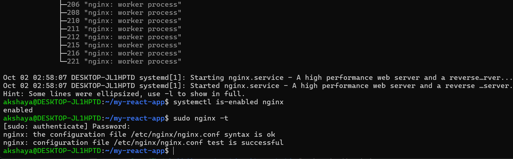

---

#### Screenshot 3 — Output of `sudo ss -lptn '( sport = :80 )'`

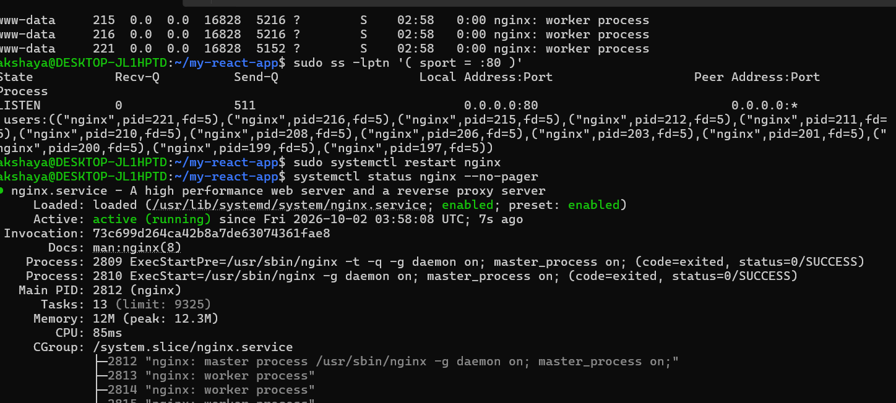

---

### Notes

Answer the following in your own words:

**1. What happens if Nginx fails to restart in production?**

If Nginx fails to restart in production, the website may become unavailable, and users may not be able to access the application. This can cause service interruptions and affect the user experience. We should check the error logs, identify the issue, and fix it as soon as possible.

---

**2. What's your basic rollback plan?**

My basic rollback plan is to keep a backup of the previous working configuration and application build. If the new deployment fails, I will restore the previous working version, test the Nginx configuration using sudo nginx -t, and restart Nginx. Finally, I will verify that the application is accessible and running properly.

---

# Task 3 — Logs & Request Trace

## Goal

Verify real traffic flow and analyze logs to understand system behavior and errors.

### Evidence

#### Screenshot 1 — Output of `sudo tail -n 30 /var/log/nginx/access.log`

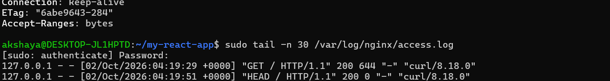

---

#### Screenshot 2 — Output of `sudo tail -n 30 /var/log/nginx/error.log`

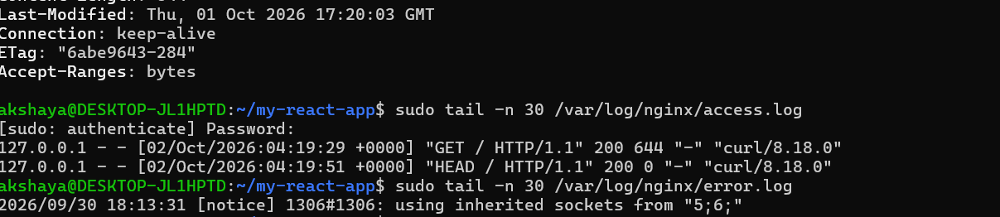

---

#### Screenshot 3 — Output of `sudo journalctl -u nginx --no-pager -n 50`

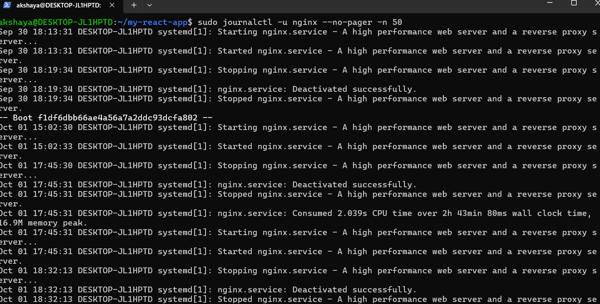

---

### Notes

Answer the following in your own words:

**1. Were there any errors in the logs?**

- If yes, mention 1–2 example error lines from the logs and explain what each one means in simple terms.
- If no, explain what it means if the error log is empty or shows no recent errors during your check.

No critical errors were found in the Nginx error logs during my check. If the error log is empty or shows no recent errors, it means Nginx did not record any errors during that period. However, this does not guarantee that the system has no issues.

---

**2. If there were no errors, what does that indicate about the system?**

If there were no errors, it indicates that Nginx is running normally and handling requests without recording any errors during the check. The HTTP/1.1 200 OK response also confirms that the server successfully responded to my localhost request.

---

**3. Based on the access logs, were your curl requests visible in the log entries? What does that prove about traffic flow?**

My curl requests should appear in the Nginx access logs if the requests were recorded. When the requests appear with a successful status code such as 200, it proves that the traffic reached Nginx, was processed, and a response was sent. This confirms that the request flow is working correctly for the tested localhost requests.

---

# Task 4 — System Resource Health Check (Capacity Red Flags)

## Goal

Assess server capacity and detect potential performance or failure risks.

### Evidence

#### Screenshot 1 — Output of `uptime`

---

#### Screenshot 2 — Output of `free -h`

---

#### Screenshot 3 — Output of `df -h`

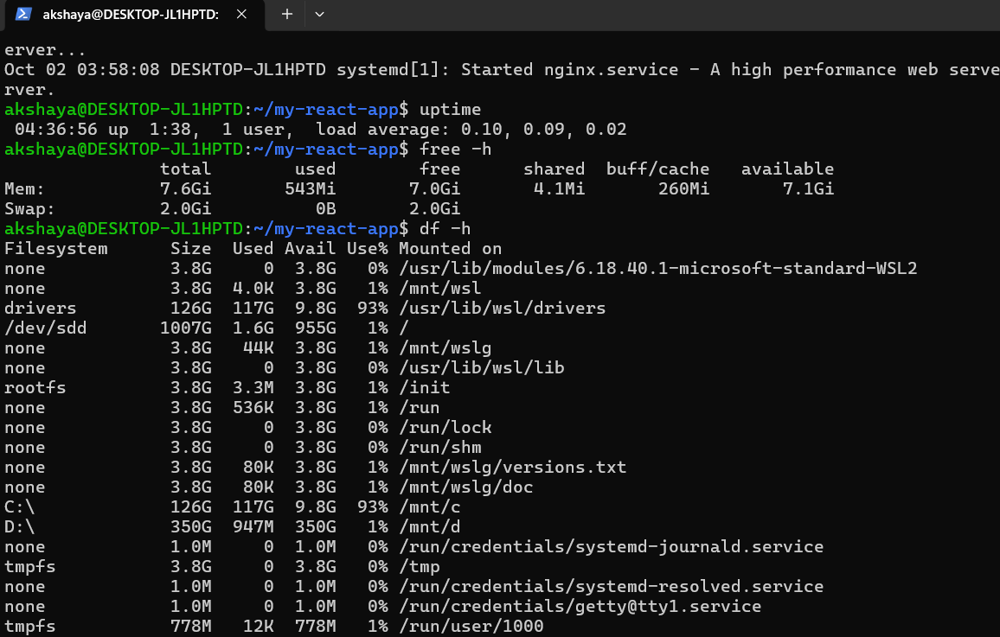

---

#### Screenshot 4 — Output of `sudo du -sh /var/* | sort -h`

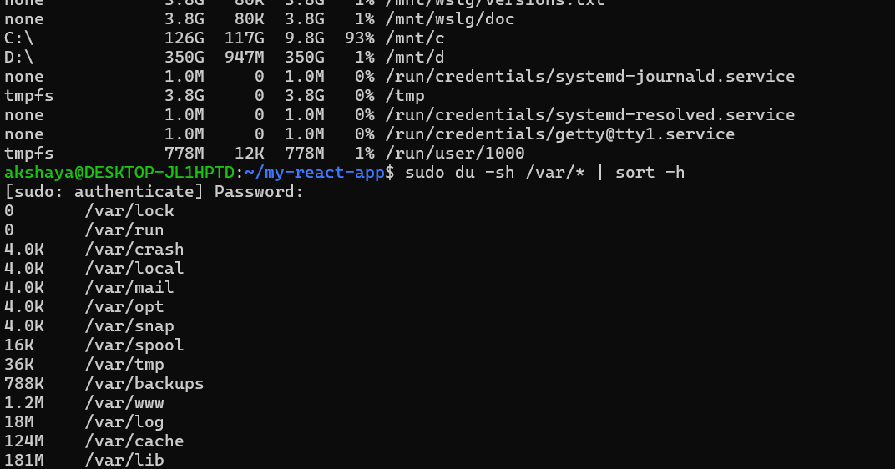

---

### Notes

Answer the following in your own words:

**1. Which resource looks most critical right now? (CPU/load, memory, or disk) Explain why.**

Based on the system resource health check, the most critical resource depends on the actual output of the uptime, free -h, and df -h commands. The resource with high usage and very little available capacity needs attention because it may affect server performance.

---

**2. What happens if disk becomes 100% full in a production server?**

If the disk becomes 100% full in a production server, the system may not be able to store new files, logs, or application data. Applications may crash or stop working, databases may fail to write data, and users may experience service interruptions. Therefore, disk usage should be monitored regularly, and unnecessary files should be cleaned up safely.

---

# Task 5 — Configuration & Deployment Verification

## Goal

Ensure the correct React build is deployed and Nginx is serving it properly.

### Evidence

#### Screenshot 1 — Output of `ls -lah /var/www/html | head -n 20`

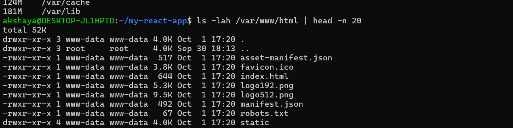

---

#### Screenshot 2 — Output of `grep -R "Deployed by" -n /var/www/html 2>/dev/null | head`

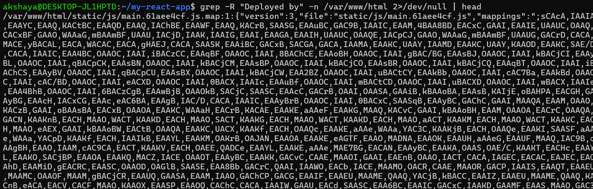

---

#### Screenshot 3 — Output of `grep -n "try_files" /etc/nginx/sites-available/default`

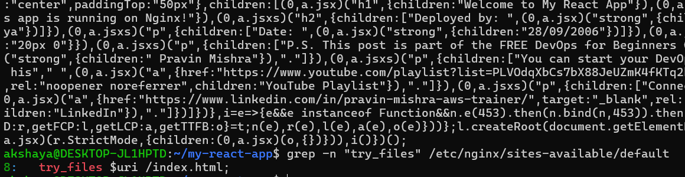

---

### Notes

Answer the following in your own words:

**1. How do you confirm that the correct version of the application is deployed?**

I checked the files in /var/www/html using the ls -lah command to verify that the React build files, such as index.html and the static folder, are present. I also used the grep command to check whether my custom text, "Deployed by Akshaya", was included in the deployed files. I verified the Nginx configuration to ensure it serves the application from the correct web root and includes the SPA routing rule. Finally, I checked the application in the browser to confirm that it loads correctly.

These checks help confirm that the intended version of the React application is deployed and served through Nginx.

---

# Task 6 — Nginx Configuration Failure Simulation

## Goal

Simulate a real-world Nginx misconfiguration and recover the service safely.

### Evidence

#### Screenshot 1 — Output of `sudo nginx -t` showing the syntax error (broken config)

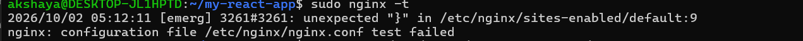

---

#### Screenshot 2 — Output of `sudo nginx -t` showing syntax ok (fixed config)

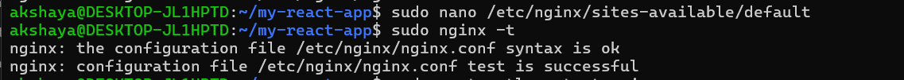

---

#### Screenshot 3 — Output of `curl -I http://<public-ip>` confirming recovery (200 OK)

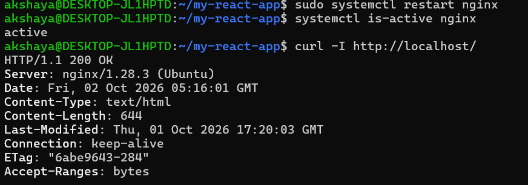

---

### Notes

Answer the following in your own words:

**1. What caused the configuration failure?**

The configuration failure was caused by removing the semicolon (;) from the try_files directive in the Nginx configuration file. This created a syntax error, which was detected by the sudo nginx -t command.

---

**2. How did you fix the issue?**

I opened the Nginx configuration file and added the missing semicolon (;) to the try_files directive. Then, I ran sudo nginx -t to verify that the configuration was correct. After the test was successful, I restarted Nginx and used the curl command to confirm that the server was responding successfully.

---

**3. How can you avoid this kind of issue in real production systems?**

We can avoid these issues by checking configuration changes carefully, keeping a backup of the previous working configuration, and running sudo nginx -t before restarting Nginx. We should also use version control, test changes in a staging environment, and monitor logs after deployment. These practices help reduce downtime and make rollback easier.

---

# Task 7 — Web Application Failure Simulation

## Goal

Simulate missing deployment content and recover the application safely.

### Evidence

#### Screenshot 1 — Output of `curl -I http://<public-ip>` showing failure (non-200 response)

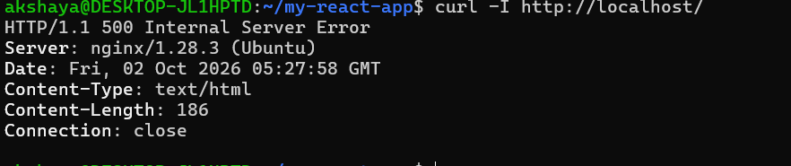

---

#### Screenshot 2 — Output of `curl -I http://<public-ip>` confirming recovery (200 OK)

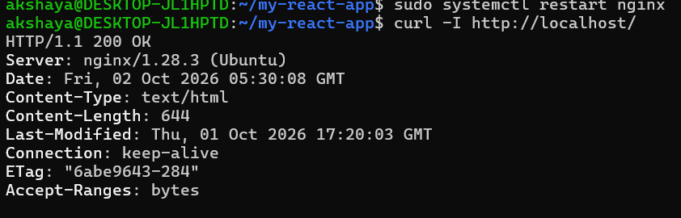

---

### Notes

Answer the following in your own words:

**1. What caused the application to break in this scenario?**

The application broke because the original web content directory /var/www/html was moved to a backup location and an empty directory was created in its place. As a result, Nginx could no longer find the deployed application files to serve the correct content.

---

**2. How did you fix the issue and restore the application?**

I restored the application by removing the empty web directory and moving the backup directory back to /var/www/html. Then, I validated the Nginx configuration, restarted the Nginx service, and used the curl command to confirm that the application was responding again.

---

**3. What steps would you take to prevent this kind of issue in real production systems?**

In production systems, I would maintain regular backups of deployed files, use version control, and deploy updates using a controlled process. I would verify the new deployment before switching traffic to it, keep a known working version for rollback, and monitor application availability after deployment. These steps help reduce downtime and prevent accidental loss of web content.

---

# Task 8 — Security & Reliability Review

## Goal

Review and reflect on the security and reliability practices applied during this assignment.

### Security & Reliability Notes

Answer the following in your own words:

**1. Why is SSH key-based authentication more secure than sharing passwords?**

SSH key-based authentication is more secure because it uses a pair of keys: a public key and a private key. The private key stays with the user and is not shared with the server. It is harder to guess or steal than a password, which helps prevent unauthorized access.

---

**2. Why should only required ports be open on a production server?**

Only required ports should be open because every open port can be a possible entry point for attackers. Closing unnecessary ports reduces the attack surface, improves security, and helps protect the server from unauthorized access.

---

**3. Why is it important for Nginx to be enabled on boot?**

Enabling Nginx on boot ensures that the web server starts automatically whenever the system restarts. This helps the website become available without requiring someone to start Nginx manually and reduces service downtime.

---

**4. What are the risks of sharing secrets, keys, or credentials publicly?**

Sharing secrets, keys, or credentials publicly can allow attackers to access servers, cloud accounts, databases, or other sensitive resources. This may lead to data theft, unauthorized changes, service disruption, and unexpected cloud costs. Therefore, credentials should be stored securely and never committed to public repositories.

---

**5. Why should cloud resources be stopped or terminated when they are no longer needed?**

Cloud resources should be stopped or terminated when they are no longer needed to avoid unnecessary costs and reduce security risks. Some resources continue to incur charges even when they are not actively used. Removing unused resources also helps keep the cloud environment organized and secure.

---

# LinkedIn Post (Required)

## Evidence

#### LinkedIn Post URL

Paste your LinkedIn post URL here:

https://lnkd.in/p/dh6WrTiC

---

#### Screenshot — Published LinkedIn post

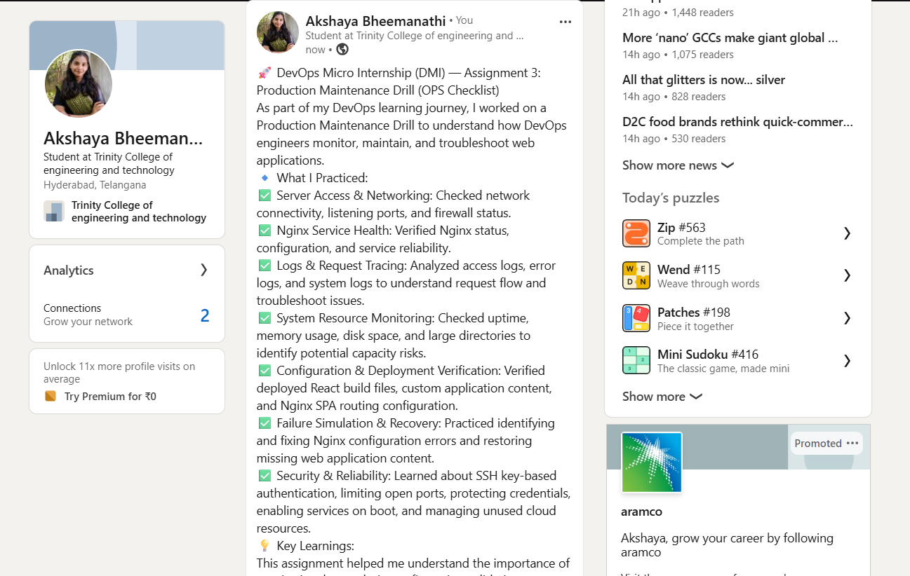

---

# Submission Instructions

- Add all required screenshots in your submission
- Full name must be visible in required screenshots
- Do not expose sensitive information (keys, passwords, account IDs)

---

# Completion Checklist

- [✅] Task 1: Screenshots (browser, ip a, ss -tulpen, ufw status) + Notes answered
- [✅] Task 2: Screenshots (nginx status, nginx -t, ss port 80) + Notes answered
- [✅] Task 3: Screenshots (access log, error log, journalctl) + Notes answered
- [✅] Task 4: Screenshots (uptime, free -h, df -h, du -sh) + Notes answered
- [✅] Task 5: Screenshots (ls html, grep deployed by, grep try_files) + Notes answered
- [✅] Task 6: Screenshots (nginx -t fail, nginx -t pass, curl recovery) + Notes answered
- [✅] Task 7: Screenshots (curl failure, curl recovery) + Notes answered
- [✅] Task 8: Security & Reliability Notes answered
- [✅] LinkedIn post published and URL submitted
- [✅] Full Name visible in all required screenshots
- [✅] No sensitive data exposed

---

## 📌 About DMI & CloudAdvisory

DevOps Micro Internship (DMI) is a project-based DevOps program run by Pravin Mishra (The CloudAdvisory) focused on real-world execution, systems thinking, and career readiness.

It helps learners build strong DevOps foundations with hands-on experience.

---

## 📌 Resources

- 🌐 DMI Official Website: https://dmi.pravinmishra.com?utm_source=github&utm_medium=readme  
- 🎓 University: https://university.pravinmishra.com?utm_source=github&utm_medium=readme  
- 💬 Discord Community: https://discord.pravinmishra.com?utm_source=github&utm_medium=readme  
- 📝 Blog: https://dmi.pravinmishra.com/blog?utm_source=github&utm_medium=readme  
- ▶️ YouTube Playlist: https://www.youtube.com/playlist?list=PLFeSNDtI4Cho  
- 🔗 Pravin Mishra (LinkedIn): https://www.linkedin.com/in/pravin-mishra-aws-trainer/  
- 🏢 CloudAdvisory (LinkedIn): https://www.linkedin.com/company/thecloudadvisory/

---

*This submission is part of DevOps Micro Internship (DMI) — Agentic AI Track.*