# Assignment 5 — Bash Script Automation Drill (OPS Checklist)

Part of the DevOps Micro Internship (DMI) with Agentic AI

---

## Purpose

In this assignment, you will practice Bash scripting by building a series of small automation scripts covering environment setup, variables, arrays, loops, file conditionals, if-else logic, and functions. These scripts form the foundation of real-world Linux automation used in DevOps, cloud, and production support environments.

---

# Task 1 — Bash Environment & Workspace Setup

## Goal

Verify that Bash is available on your system and create a clean workspace for this assignment.

### Evidence

#### Screenshot 1 — Output of `echo $SHELL` and `bash --version`

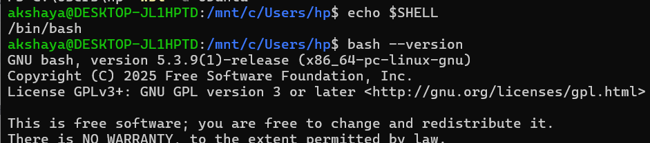

---

#### Screenshot 2 — Output of `pwd` and `ls -lah` showing the scripts directory

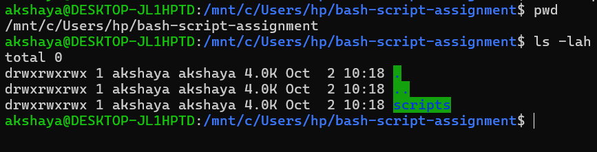

---

### Notes

Answer the following in your own words:

**1. What is Bash?**

Bash (Bourne Again Shell) is a command-line interpreter that allows users to interact with the operating system, execute commands, and write scripts to automate tasks.

---

**2. What is the difference between shell and Bash?**

- Shell: A shell is a general interface between the user and the operating system. It accepts commands and executes them. Examples include Bash, Zsh, and Fish.
- Bash: Bash is a specific type of shell. It supports command execution, variables, loops, conditions, and scripting.
In simple terms: Shell is a general concept, whereas Bash is one particular implementation of a shell.

---

**3. Why is it important to confirm the Bash version before writing scripts?**

Confirming the Bash version is important because different versions may support different features and commands. Checking the version helps to:
- Ensure compatibility with the features used in the script.
- Avoid errors caused by unsupported syntax or commands.
- Make sure the script runs correctly in the target environment.
- Improve portability and reliability across different systems.
To check the Bash version, use:
bash --version

---

# Task 2 — Your First Bash Script

## Goal

Create your first Bash script, make it executable, and run it from the terminal.

### Evidence

#### Screenshot 1 — Content of `first-script.sh`

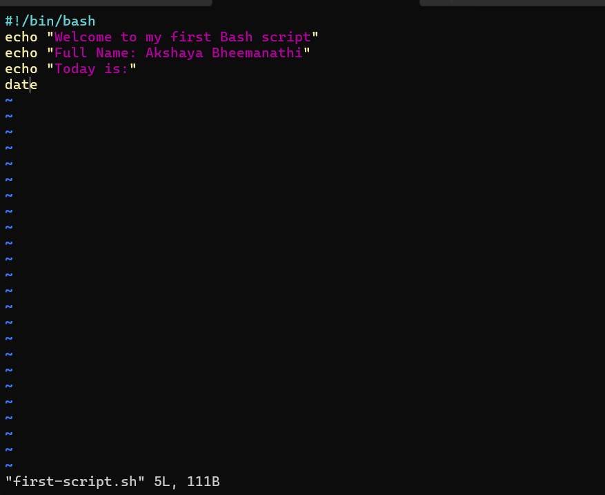

---

#### Screenshot 2 — Output of `./first-script.sh`

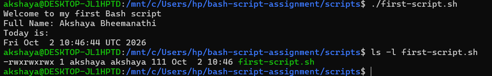

---

#### Screenshot 3 — Output of `ls -l first-script.sh` showing executable permission

---

### Notes

Answer the following in your own words:

**1. What is the purpose of `#!/bin/bash`?**

#!/bin/bash is called a shebang. It tells the operating system to use the Bash interpreter to execute the script. It helps the system understand which interpreter should run the script.

---

**2. Why do we use `chmod +x` before running a script?**

chmod +x is used to give a script execute permission. Without this permission, we cannot directly run the script using ./script.sh. It allows the operating system to execute the file as a program.

---

**3. What is the difference between running a script using `./script.sh` and `bash script.sh`?**

chmod +x is used to give a script execute permission. Without this permission, we cannot directly run the script using ./script.sh. It allows the operating system to execute the file as a program.

---

# Task 3 — Variables: User Information Script

## Goal

Use variables to store and display user-related information.

### Evidence

#### Screenshot 1 — Content of `user-info.sh`

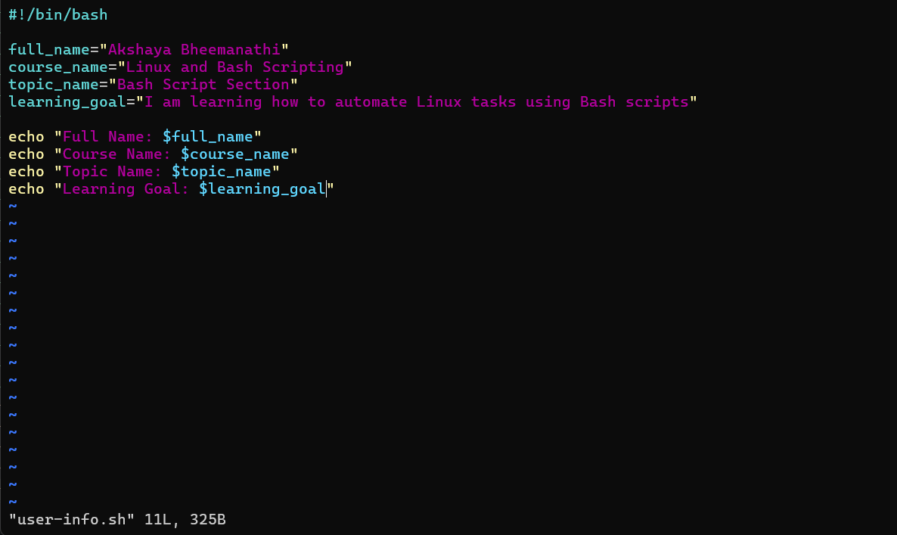

---

#### Screenshot 2 — Output of `./user-info.sh`

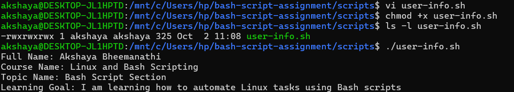

---

### Notes

Answer the following in your own words:

**1. What is a variable in Bash?**

A variable in Bash is a name used to store data or information. It allows us to save values such as names, numbers, and text and reuse them whenever needed in a script.

Example:
full_name="Akshaya"

---

**2. Why should we avoid spaces around the `=` sign when creating variables?**

In Bash, spaces around the = sign are not allowed when assigning a value to a variable. Bash treats spaces as separators between commands and arguments, which can cause errors.

Correct:
name="Akshaya"

Incorrect:
name = "Akshaya"

---

**3. How do you access the value stored inside a Bash variable?**

We use the $ symbol followed by the variable name to access its stored value. We can use echo to display the value on the screen.

Example:
name="Akshaya"
echo "$name"

Output:
Akshaya

---

# Task 4 — Arrays & Loops: Tools Checklist Script

## Goal

Use arrays and loops to print a checklist of tools used in Bash scripting.

### Evidence

#### Screenshot 1 — Content of `tools-checklist.sh`

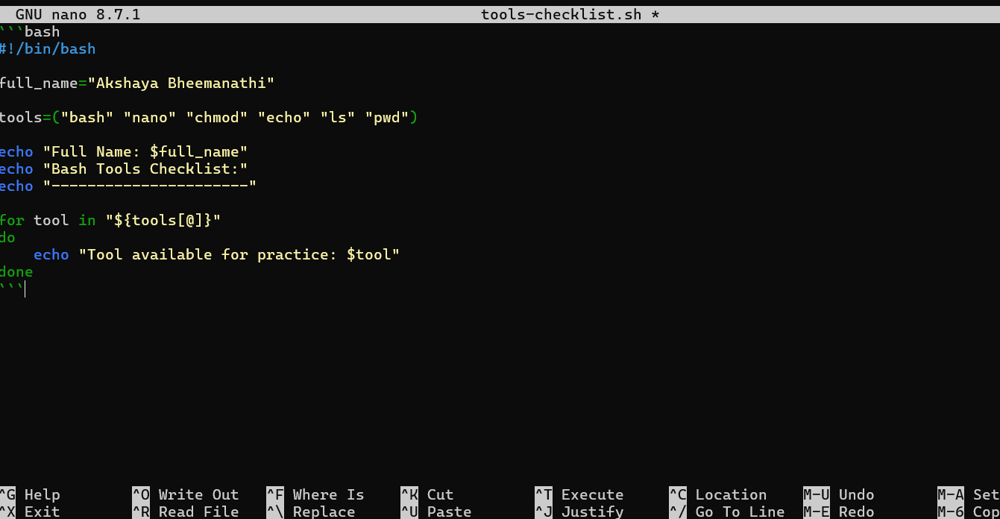

---

#### Screenshot 2 — Output of `./tools-checklist.sh`

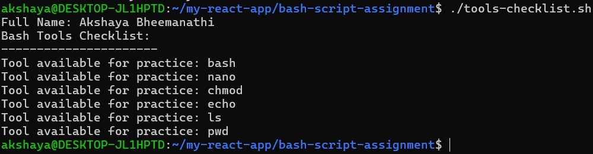

---

### Notes

Answer the following in your own words:

**1. What is an array in Bash?**

An array in Bash is a variable that can store multiple values under a single name. Each value is stored as an individual element in the array.

Example:

tools=("bash" "nano" "chmod")

---

**2. Why are arrays useful in scripts?**

Arrays are useful because they allow us to store and manage multiple values in a single variable. They make scripts easier to organize, reduce repeated code, and help us process multiple items using loops.

---

**3. What does `"${tools[@]}"` mean?**

${tools[@]} is used to access all the elements stored in the tools array. It allows the script to process each element separately, including elements containing spaces.

---

**4. What is the purpose of the `for` loop in this script?**

The for loop is used to go through each element in the tools array one by one. It assigns each element to the tool variable and uses echo to print it. The loop continues until all the array elements are displayed.

---

# Task 5 — Loops: Number Counter Script

## Goal

Use loops to repeat a task multiple times.

### Evidence

#### Screenshot 1 — Content of `counter.sh`

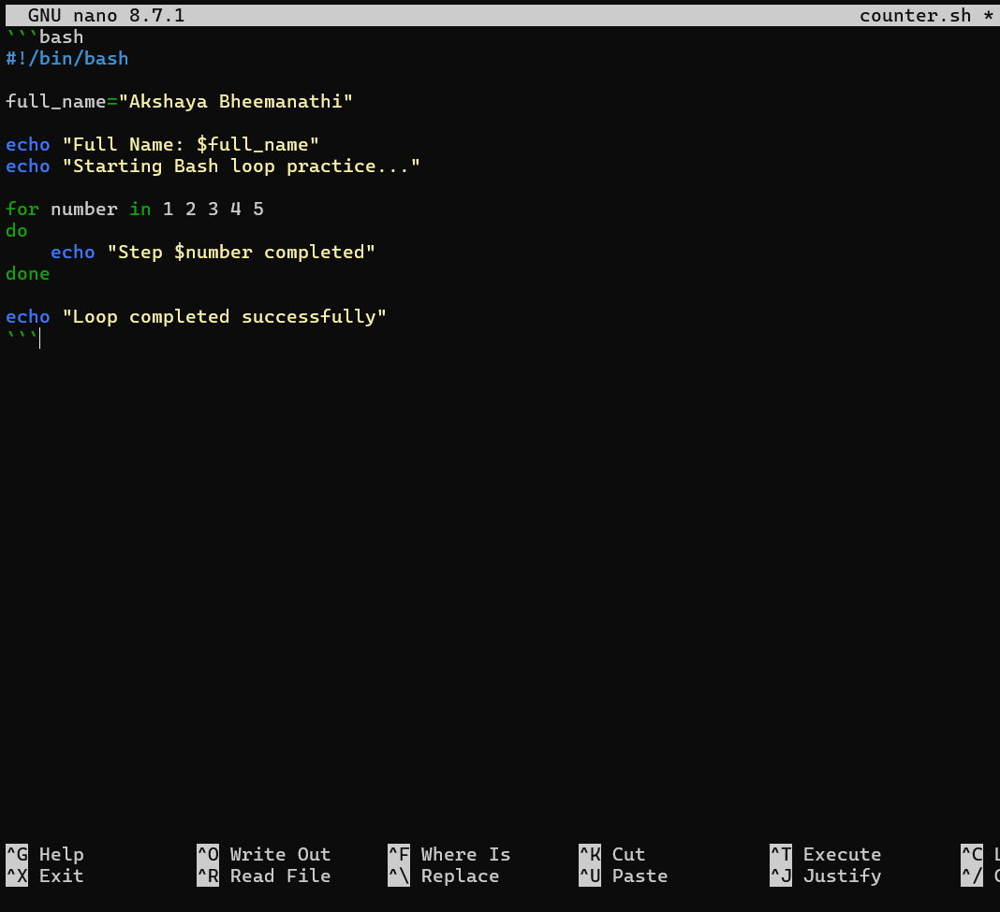

---

#### Screenshot 2 — Output of `./counter.sh`

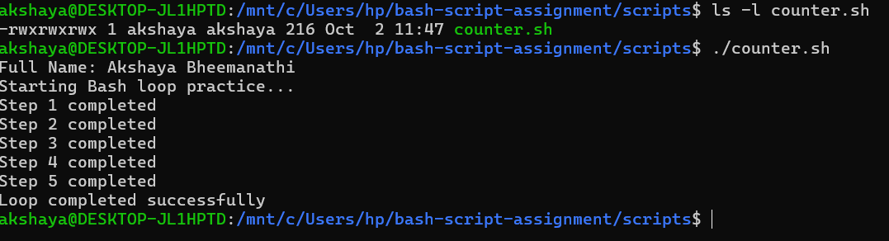

---

### Notes

Answer the following in your own words:

**1. What is a loop?**

A loop is a programming structure that repeats a set of instructions multiple times until a given condition or sequence is completed.

---

**2. Why do we use loops in Bash scripting?**

We use loops in Bash scripting to repeat tasks automatically without writing the same commands again and again. They reduce code repetition, save time, and make scripts easier to manage.

---

**3. How many times did the loop run in your script?**

The loop ran 5 times, because the script contains the numbers 1, 2, 3, 4, and 5. Each number represents one iteration of the loop.

---

**4. What would you change if you wanted the loop to run 10 times?**

I would change the number sequence in the for loop from 1 2 3 4 5 to 1 2 3 4 5 6 7 8 9 10.

Example:

for number in {1..10}
do
    echo "Step $number completed"
done

This loop runs 10 times and prints each step from 1 to 10.

---

# Task 6 — Files & Conditionals: File Validation Script

## Goal

Use file checks and conditionals to verify whether files and directories exist.

### Evidence

#### Screenshot 1 — Output of `ls -lah ../test-folder`

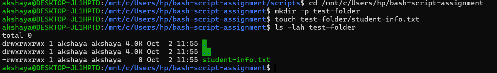

---

#### Screenshot 2 — Content of `file-check.sh`

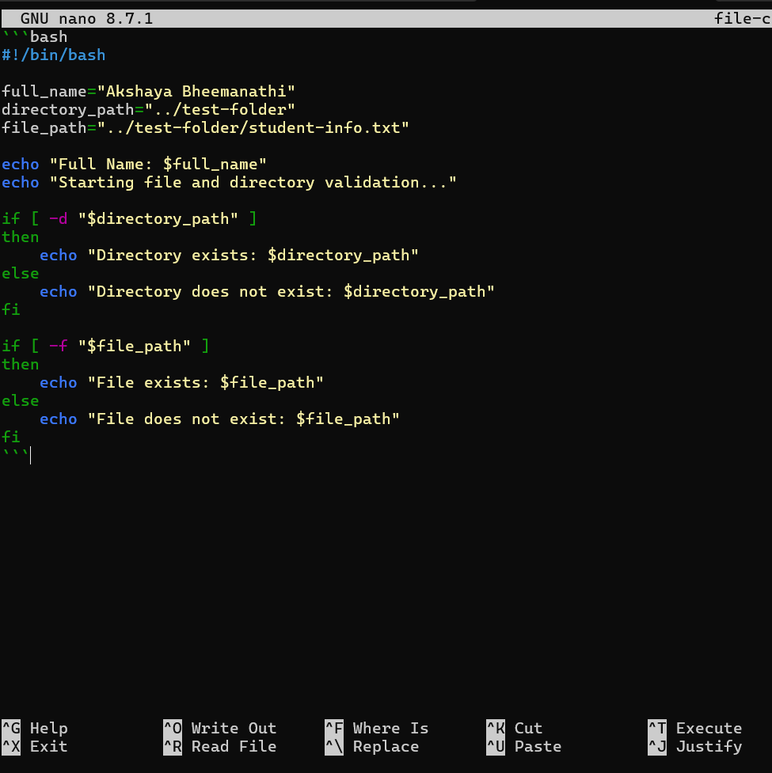

---

#### Screenshot 3 — Output of `./file-check.sh`

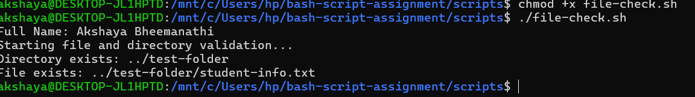

---

### Notes

Answer the following in your own words:

**1. What does `-d` check in Bash?**

-d checks whether a given path exists and is a directory (folder). If the directory exists, it returns true; otherwise, it returns false.

---

**2. What does `-f` check in Bash?**

-f checks whether a given path exists and is a regular file. If the file exists, it returns true; otherwise, it returns false.

---

**3. Why should file and directory paths be stored in variables?**

Storing paths in variables makes the script easier to read, understand, and maintain. If a path changes, we only need to update the variable instead of changing it in multiple places.

---

**4. What happens if the file does not exist?**

If the file does not exist, the -f condition returns false, and the else block executes. It displays a message such as:
File does not exist: ../test-folder/student-info.txt
This helps us identify missing files and handle them without stopping the script.

---

# Task 7 — Conditionals: Pass or Retry Script

## Goal

Use if-else conditionals to make decisions based on a variable value.

### Evidence

#### Screenshot 1 — Content of `score-check.sh` with `score=85`

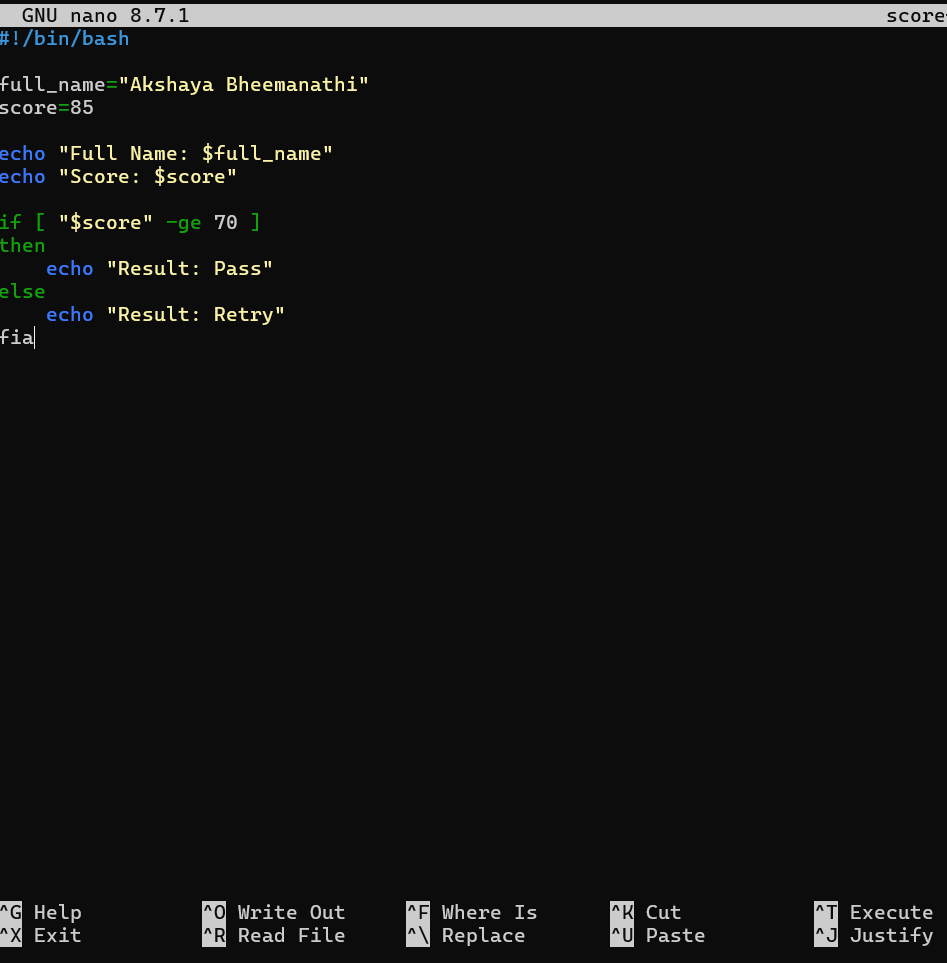

---

#### Screenshot 2 — Output showing `Result: Pass`

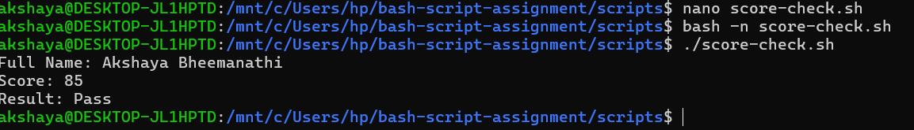

---

#### Screenshot 3 — Content of `score-check.sh` with `score=55`

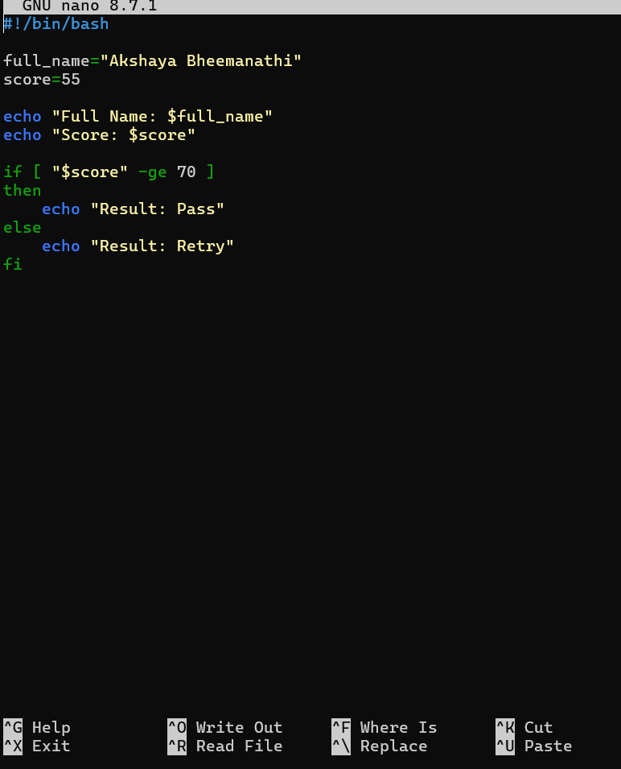

---

#### Screenshot 4 — Output showing `Result: Retry`

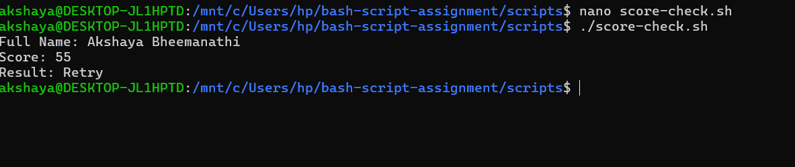

---

### Notes

Answer the following in your own words:

**1. What is the purpose of if-else in Bash?**

The if-else statement is used to make decisions based on a condition. If the condition is true, the if block is executed. Otherwise, the else block is executed.

---

**2. What does `-ge` mean?**

-ge means greater than or equal to. It is used to compare two numbers. For example, 85 -ge 70 is true because 85 is greater than 70.

---

**3. Why should conditions be tested with different values?**

Conditions should be tested with different values to ensure that the script works correctly in different situations. For example, testing with 85 should display Pass, while testing with 55 should display Retry.

---

**4. How can conditionals help in automation scripts?**

Conditionals help automation scripts make decisions automatically based on specific conditions. They reduce manual work, handle different situations, and make scripts more efficient and reliable.

---

# Task 8 — Functions: Final Bash Automation Script

## Goal

Create a final Bash script using functions to organize reusable code.

### Evidence

#### Screenshot 1 — Content of `final-automation.sh`

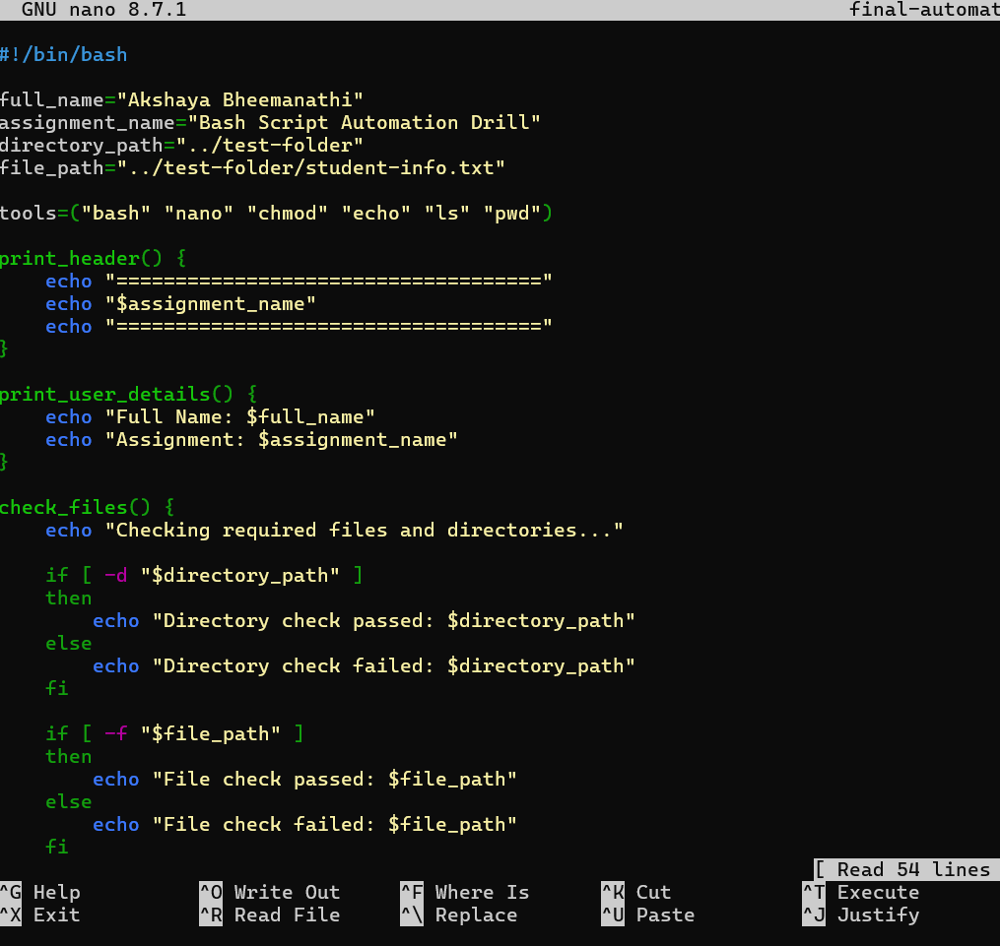

---

#### Screenshot 2 — Output of `./final-automation.sh`

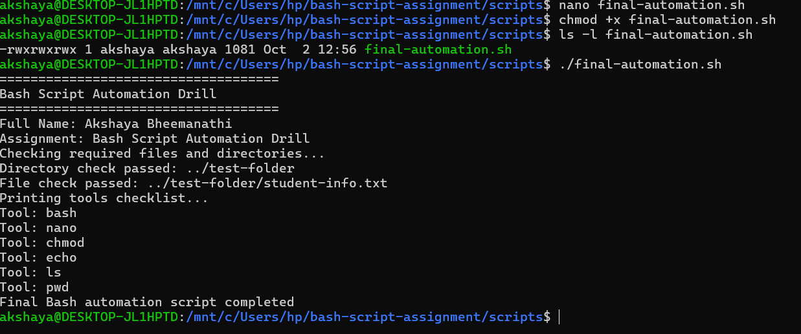

---

#### Screenshot 3 — Output of `ls -lah` showing all created scripts

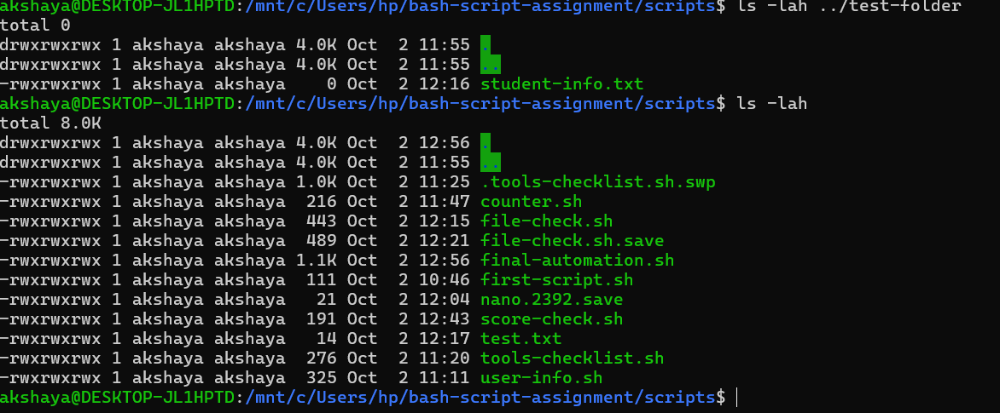

---

### Notes

Answer the following in your own words:

**1. What is a function in Bash?**

A function in Bash is a block of code that performs a specific task. It can be called whenever needed in a script, which helps organize the code.

---

**2. Why are functions useful in scripts?**

Functions are useful because they:
- Reduce code repetition.
- Make scripts easier to read and understand.
- Organize code into smaller tasks.
- Make scripts easier to maintain and reuse.

---

**3. Which functions did you create in this script?**

I created four functions:
- print_header() – Displays the assignment header.
- print_user_details() – Displays the user's full name and assignment name.
- check_files() – Checks whether the required directory and file exist.
- print_tools() – Uses an array and a loop to print the list of tools.

---

**4. How does this final script combine variables, arrays, loops, conditionals, files, and functions?**

The final script combines different Bash concepts to automate tasks:
- Variables store the user's name, assignment name, directory path, and file path.
- Arrays store a list of Bash tools.
- Loops print each tool from the array one by one.
- Conditionals use -d and -f to check whether the directory and file exist.
- Files are checked to verify that the required resources are available.
- Functions organize the code into reusable tasks and execute them in the correct order.
Together, these concepts make the script organized, reusable, and useful for automating tasks.

---

# LinkedIn Post (Required)

## Evidence

#### LinkedIn Post URL

Paste your LinkedIn post URL here:

https://lnkd.in/p/d8HnbFUz

---

#### Screenshot — Published LinkedIn post

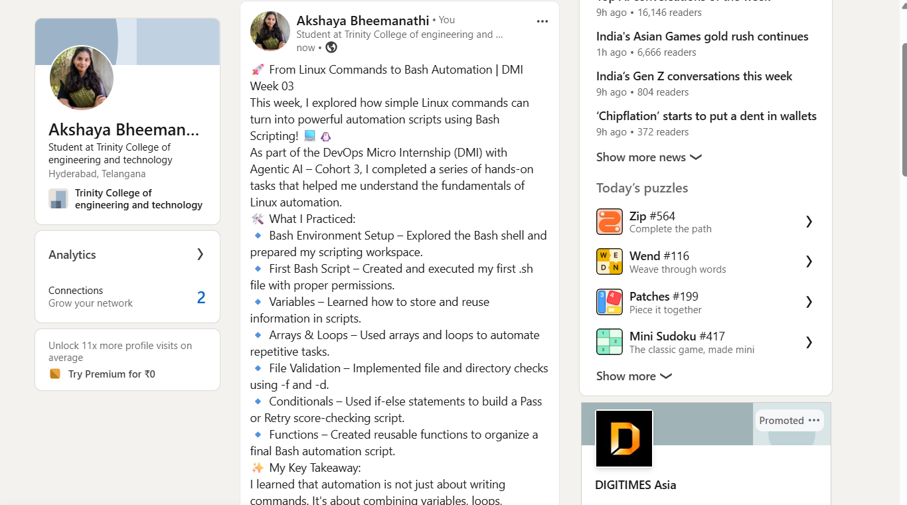

---

# Submission Instructions

- Add all required screenshots in your submission
- Full name must be visible in required screenshots
- All script files must be created and run successfully
- Required notes must be answered clearly for every task
- Do not expose sensitive information (keys, passwords, credentials)

---

# Completion Checklist

- [✅] Task 1: Environment setup verified, workspace created (Screenshots 1–2, Notes answered)
- [✅] Task 2: First script created, executed, permissions verified (Screenshots 1–3, Notes answered)
- [✅] Task 3: Variables script created and run (Screenshots 1–2, Notes answered)
- [✅] Task 4: Arrays and loops script created and run (Screenshots 1–2, Notes answered)
- [✅] Task 5: Counter loop script created and run (Screenshots 1–2, Notes answered)
- [✅] Task 6: File validation script created and run (Screenshots 1–3, Notes answered)
- [✅] Task 7: Pass/Retry conditional script tested with both values (Screenshots 1–4, Notes answered)
- [✅] Task 8: Final automation script created and run (Screenshots 1–3, Notes answered)
- [✅] All scripts run without errors
- [✅] Full Name visible in all required screenshots
- [✅] LinkedIn post published and URL submitted
- [✅] No sensitive data exposed

---

## 📌 About DMI & CloudAdvisory

DevOps Micro Internship (DMI) is a project-based DevOps program run by Pravin Mishra (The CloudAdvisory) focused on real-world execution, systems thinking, and career readiness.

It helps learners build strong DevOps foundations with hands-on experience.

---

## 📌 Resources

- 🌐 DMI Official Website: https://dmi.pravinmishra.com?utm_source=github&utm_medium=readme  
- 🎓 University: https://university.pravinmishra.com?utm_source=github&utm_medium=readme  
- 💬 Discord Community: https://discord.pravinmishra.com?utm_source=github&utm_medium=readme  
- 📝 Blog: https://dmi.pravinmishra.com/blog?utm_source=github&utm_medium=readme  
- ▶️ YouTube Playlist: https://www.youtube.com/playlist?list=PLFeSNDtI4Cho  
- 🔗 Pravin Mishra (LinkedIn): https://www.linkedin.com/in/pravin-mishra-aws-trainer/  
- 🏢 CloudAdvisory (LinkedIn): https://www.linkedin.com/company/thecloudadvisory/

---

*This submission is part of DevOps Micro Internship (DMI) — Agentic AI Track.*