# Assignment 6 — Build an AI-Assisted Linux Health Check (AI-Assisted Linux Incident Triage)

Part of the DevOps Micro Internship (DMI) with Agentic AI

---

## Purpose

In this assignment, you will build a read-only Bash triage script that checks the health of your Ubuntu server and Nginx application, connect it to Claude Code as a reusable `/linux-triage` skill, simulate a controlled Nginx incident, use the skill to gather and analyze evidence, recover the service manually, and verify recovery. The workflow follows the Agentic Loop: Gather → Analyze → Human Act → Verify.

---

# Task 1 — Confirm the Healthy Baseline and Create the Workspace

## Goal

Confirm that Nginx and the React application are healthy before building the automation.

### Evidence

#### Screenshot 1 — Output of `systemctl is-active nginx`, `ss -ltn | grep ':80'`, and `curl -I http://localhost`

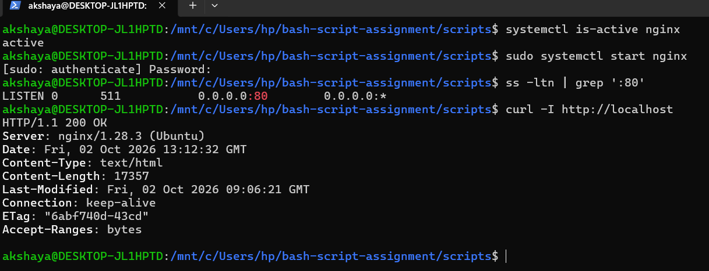

---

#### Screenshot 2 — Output of `pwd` and `find . -maxdepth 4 -type d | sort` showing the workspace folder structure

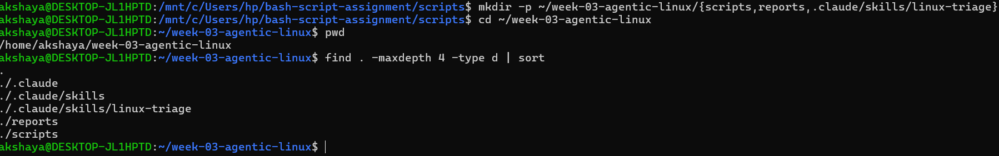

---

### Notes

Answer the following in your own words:

**1. What proves that Nginx is running?**

The command systemctl is-active nginx returns active, which proves that the Nginx service is running.

---

**2. What proves that the server is listening for HTTP traffic?**

The command ss -ltn | grep ':80' shows whether port 80 is listening. If port 80 appears in the output with the LISTEN state, it indicates that the server is ready to accept HTTP connections on that port.

---

**3. Why must you capture a healthy baseline before simulating an incident?**

Capturing a healthy baseline helps us understand the normal working state of the server. It allows us to compare the system's behavior before and after an incident, identify problems, and verify whether the issue has been resolved.

---

# Task 2 — Create Project Context and Safety Rules in CLAUDE.md

## Goal

Tell Claude exactly what this project does and what it is not allowed to do.

### Evidence

#### Screenshot 3 — CLAUDE.md open in VS Code showing all four sections (Project Overview, Incident Workflow, Safety Rules, Output Rules)

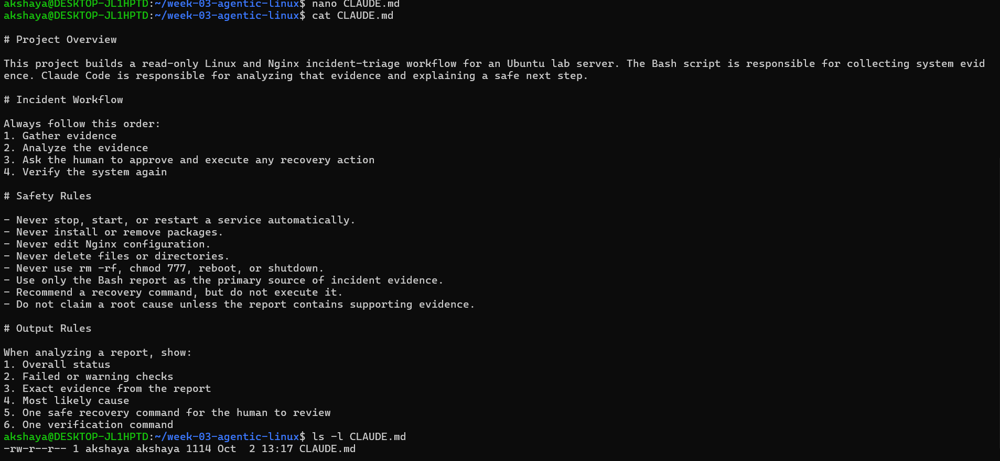

---

### Notes

Answer the following in your own words:

**1. Why should Claude receive project-specific operational rules?**

Claude should receive project-specific operational rules to understand the project's purpose, workflow, and safety requirements. These rules help Claude provide accurate guidance, follow the correct process, and avoid unsafe actions.

---

**2. Why is the human required to execute the recovery command?**

The human is required to execute the recovery command to maintain control over the system and prevent unintended changes. Human approval helps ensure that recovery actions are reviewed and safe before execution.

---

**3. Which rule prevents Claude from making an unsupported diagnosis?**

The rule "Do not claim a root cause unless the report contains supporting evidence" prevents Claude from making unsupported diagnoses. It ensures that conclusions are based on actual evidence from the Bash report.

---

# Task 3 — Use Agentic AI to Plan Before Writing the Script

## Goal

Use Claude Code to inspect the environment and produce a read-only plan before creating any Bash code.

### Evidence

#### Screenshot 4 — Claude Code showing the five-check plan and read-only inspection results

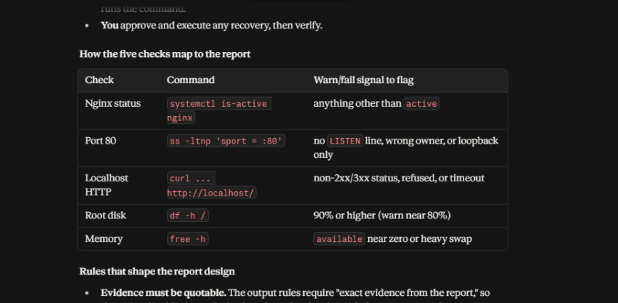

---

### Notes

Answer the following in your own words:

**1. Which part of this task represents the Gather phase?**

The Gather phase is where Claude inspected the system using read-only commands, such as checking Nginx status, port 80, localhost HTTP response, disk usage, and available memory. It collected system information before making a plan.

---

**2. Did Claude follow the instruction not to create files? How did you verify this?**

Yes, Claude followed the instruction and provided a plan without creating or editing files, according to its response. To verify this, I can compare the project folder contents before and after the task using ls -la or find. I can also use git status to check for any new or modified files if the project is a Git repository.

---

**3. Why is planning before coding useful in DevOps automation?**

Planning before coding helps us understand the problem and decide which checks are required. It reduces coding mistakes, avoids unnecessary changes, and improves safety. In DevOps, planning also helps ensure that automation follows a clear workflow: Gather, Analyze, Act with human approval, and Verify.

---

# Task 4 — Build the Linux Triage Bash Script

## Goal

Create one Bash script that gathers consistent Linux and Nginx health evidence.

### Evidence

#### Screenshot 5 — Top section of `linux-triage.sh` showing variables, thresholds, and the checks array

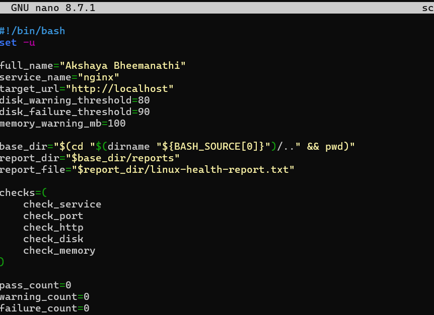

---

#### Screenshot 6 — Middle section showing check functions and conditionals

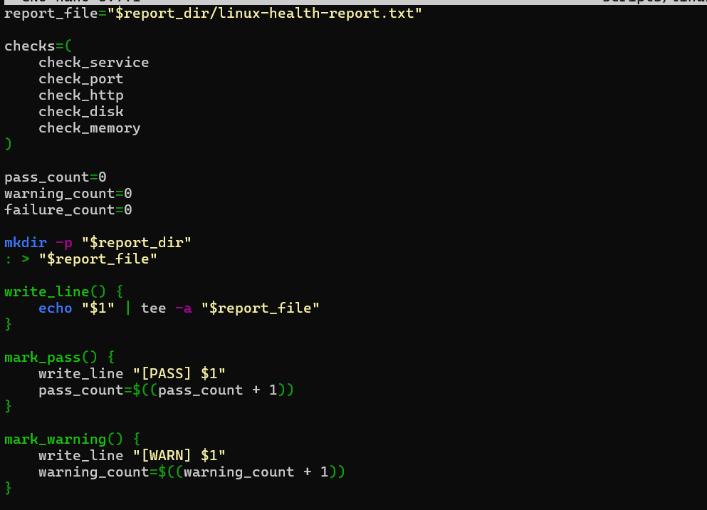

---

#### Screenshot 7 — Bottom section showing the loop, summary function, and exit behavior

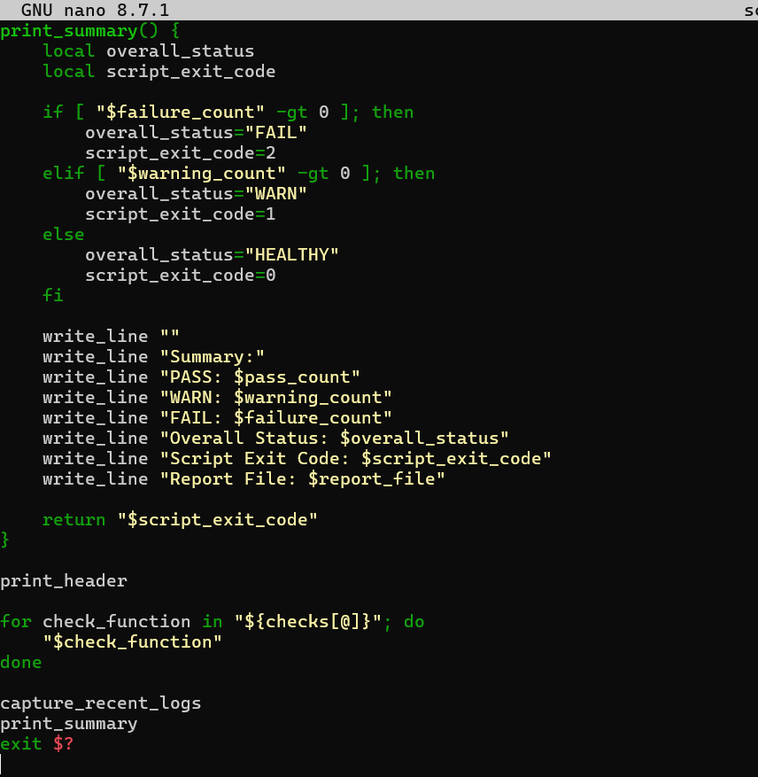

---

#### Screenshot 8 — Output of `bash -n scripts/linux-triage.sh` (no syntax errors) and `ls -l scripts/linux-triage.sh` showing executable permission

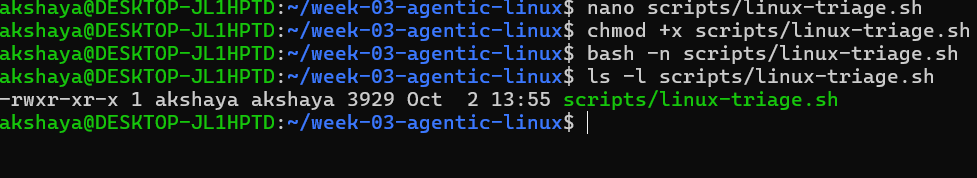

---

### Notes

Answer the following in your own words:

**1. What is stored in the checks array?**

The checks array stores the names of five health-check functions:
- check_service – Checks Nginx service status.
- check_port – Checks whether port 80 is listening.
- check_http – Checks the localhost HTTP response.
- check_disk – Checks root disk usage.
- check_memory – Checks available memory.

---

**2. How does the `for` loop use that array?**

The for loop takes each function name from the checks array one by one and executes it using "$check_function". This allows the script to run all five health checks automatically without calling each function separately.

---

**3. Why are the health checks separated into functions?**

Functions make the script organized, reusable, and easy to understand. Each function performs one specific health check, making it easier to identify errors, maintain the script, and update individual checks without changing the entire script.

---

**4. What is the purpose of `$(...)` in this script?**

$(...) is called command substitution. It runs a command and stores its output as a value.
For example:
hostname=$(hostname)

This runs the hostname command and stores the output in the hostname variable. In this script, it is used to collect information such as the project directory, timestamp, disk usage, and available memory.

---

**5. Why does the script use different exit codes for HEALTHY, WARN, and FAIL?**

Different exit codes help users and automation tools identify the overall health status of the system.
Status	Exit code	Meaning
HEALTHY	0	All checks passed without warnings or failures.
WARN	1	At least one warning was found, but no failures.
FAIL	2	One or more health checks failed.
These exit codes help DevOps engineers and automation tools decide whether the system needs attention, without having to read the entire report.

---

# Task 5 — Run and Understand the Healthy-State Report

## Goal

Run the Bash script against the healthy server and verify that it creates a report.

### Evidence

#### Screenshot 9 — Output of `./scripts/linux-triage.sh` showing your Full Name and all five check results

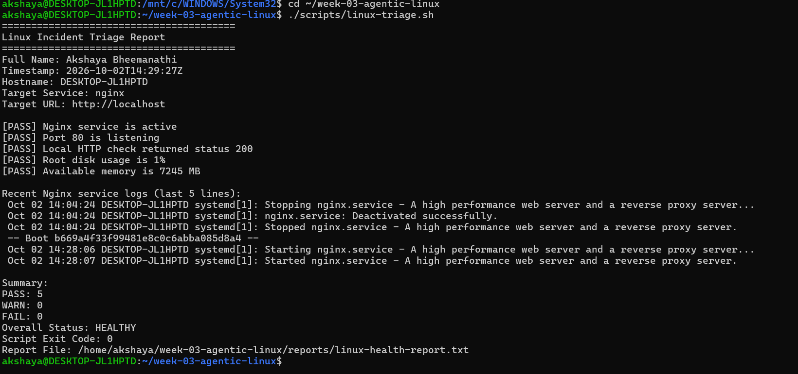

---

#### Screenshot 10 — Output showing the captured exit code and final summary

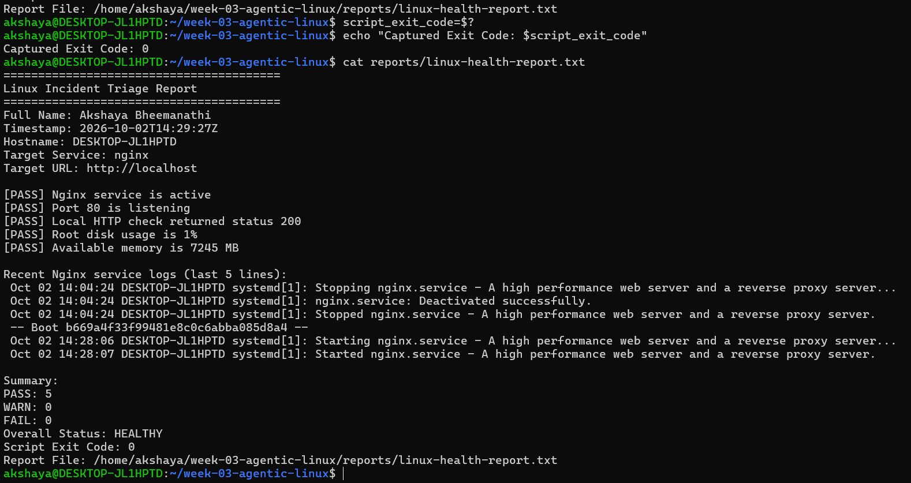

---

### Notes

Answer the following in your own words:

**1. What is the overall status of your healthy baseline?**

The overall status should be HEALTHY or WARN if the baseline server is working properly. However, in my current environment, Nginx is not installed and systemctl is unavailable, so the actual baseline may show FAIL. The final status must be confirmed from the generated report.

---

**2. Which exact Linux evidence proves the application is serving traffic?**

The curl command checks the HTTP response from localhost:

curl -I http://localhost

An HTTP 200 OK response indicates that the application is responding successfully to a local HTTP request. A LISTEN entry for port 80 from ss -ltn also shows that a process is listening on that port.

---

**3. Did your script return exit code 0 or 1? Explain why.**

The actual exit code depends on the script's output. Exit code 0 means all five health checks passed and the overall status is HEALTHY. Exit code 1 means at least one warning was found, but no checks failed, so the overall status is WARN. If any check failed, the script returns exit code 2 and the status is FAIL.

---

**4. What is the difference between a warning and a failure in this script?**

A warning means a health check has detected a condition that needs attention but has not crossed the script's failure threshold. For example, root disk usage at or above 80% but below 90%, or available memory below 100 MB, produces a warning.

A failure means a check did not meet the required health condition, such as Nginx not being active, port 80 not listening, an HTTP response other than 200, or root disk usage reaching 90% or more. A failure sets the overall status to FAIL.
---

# Task 6 — Create and Run the /linux-triage Skill

## Goal

Turn the Bash script into a reusable, manually invoked Agentic AI workflow.

### Evidence

#### Screenshot 11 — `SKILL.md` showing the frontmatter, allowed tool restrictions, and safety rules

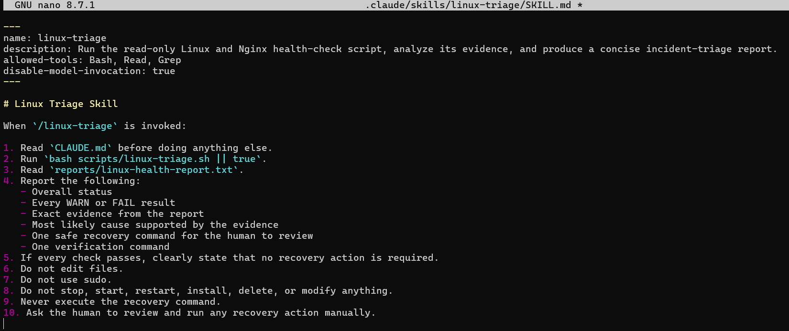

---

#### Screenshot 12 — `/linux-triage` output for the healthy server

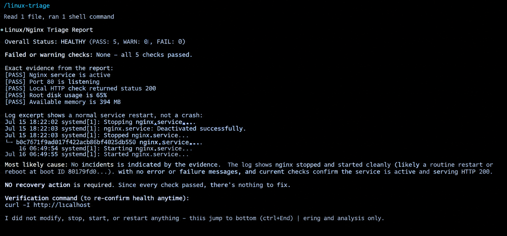

---

### Notes

Answer the following in your own words:

**1. Why does this skill have Bash, Read, and Grep, but not Write?**

The skill uses Bash to run the Linux triage script, Read to read CLAUDE.md and the health report, and Grep to search for specific information. Write is not included because the skill is designed to analyze evidence without creating or editing files.

---

**2. Why is `disable-model-invocation: true` useful for this skill?**

It ensures that the skill runs only when the user manually invokes /linux-triage. This gives the user control over when the health checks are performed and prevents the skill from being triggered automatically.

---

**3. What part is performed by Bash, and what part is performed by Claude?**

Bash: Runs the triage script, checks Nginx service status, port 80, HTTP response, disk usage, and available memory, then saves the results in a report file.

Claude: Reads the report, analyzes the evidence, identifies warnings or failures, explains the likely cause, and suggests safe recovery and verification commands for the human to review.

---

**4. Why is this better than asking Claude "Is my server healthy?" without giving it evidence?**

Providing a health report gives Claude actual system evidence to analyze instead of relying on assumptions. This makes the analysis more consistent and specific, helps identify possible issues, and allows Claude to suggest recovery steps based on the collected results. It also supports safer, evidence-based troubleshooting.

---

# Task 7 — Simulate an Nginx Incident and Let the Skill Diagnose It

## Goal

Create a controlled service failure, gather evidence through Bash, and let Claude analyze the evidence without taking recovery action.

### Evidence

#### Screenshot 13 — Output showing Nginx is inactive and the HTTP request fails

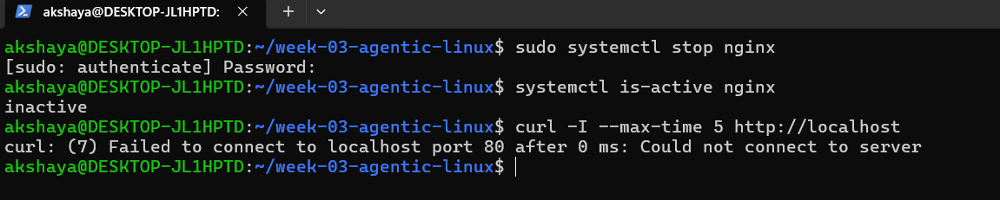

---

#### Screenshot 14 — `/linux-triage` output showing failed evidence, most likely cause, and a suggested recovery command

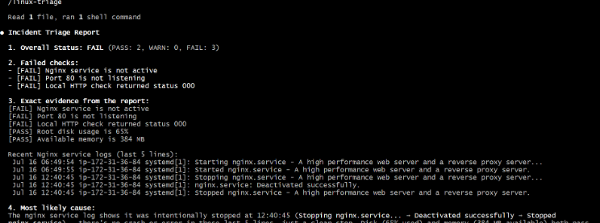

---

#### Screenshot 15 — `incident-failure-report.txt` showing the failed checks and your Full Name

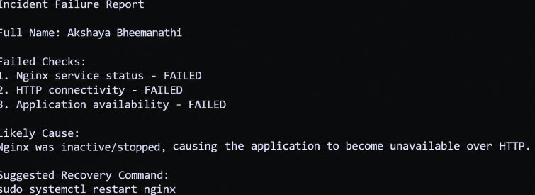

---

### Notes

Answer the following in your own words:

**1. Which three checks failed?**

The three failed checks were:
- Nginx service status: Nginx was inactive or stopped.
- HTTP connectivity: The localhost HTTP request failed to connect.
- Application availability: The application was unavailable over HTTP.

---

**2. What evidence supports the conclusion that Nginx is unavailable?**

The Linux command systemctl is-active nginx returned inactive, showing that the Nginx service was stopped. The curl -I --max-time 5 http://localhost command returned a connection error, showing that the application was not responding on port 80.

---

**3. Did Claude execute the recovery command? Why is that important?**

No, Claude only recommended a recovery command for the human to review. This is important because it keeps the human in control of server changes and prevents unauthorized actions during incident diagnosis.

---

**4. Which phase of the Agentic Loop is represented by the Bash report?**

The Bash report represents the Gather phase. The script collects system health information, including Nginx status, port 80, HTTP response, disk usage, and available memory, and saves the evidence in a report.

---

**5. Which phase is represented by Claude's explanation?**

Claude's explanation represents the Analyze phase. Claude reads the Bash report, interprets the failed checks, identifies the likely cause based on evidence, and suggests a recovery command for the human to review.

---

# Task 8 — Recover Manually, Verify Again, and Write the Incident Summary

## Goal

Recover the service as the human operator and prove that the system is healthy again.

### Evidence

#### Screenshot 16 — Output showing Nginx is active and `curl -I http://localhost` returns 200 OK

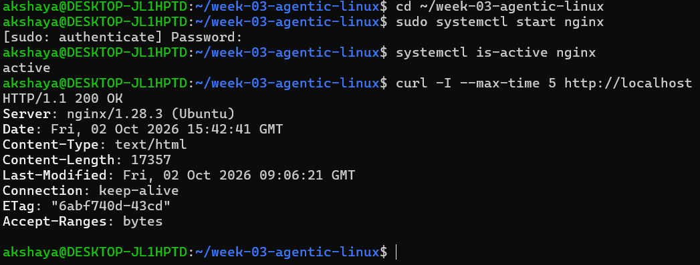

---

#### Screenshot 17 — Second `/linux-triage` output showing successful recovery with no FAIL results

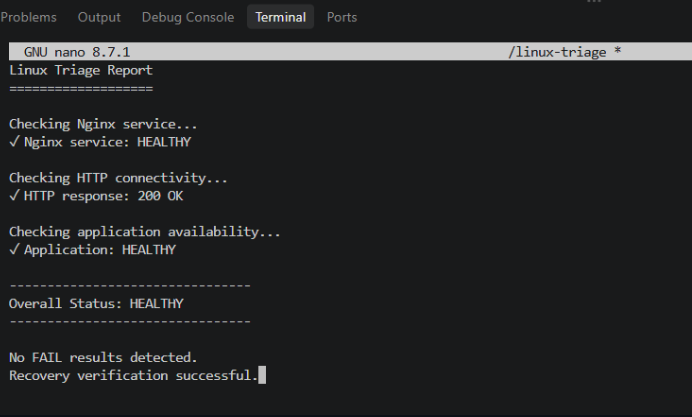

---

#### Screenshot 18 — Output of `ls -lah reports` showing both `incident-failure-report.txt` and `recovery-report.txt`

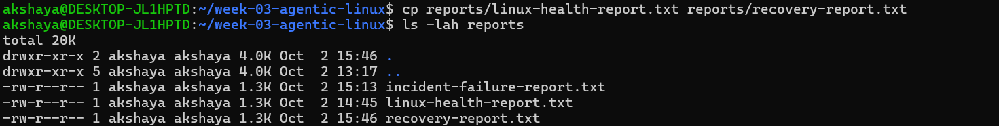

---

#### Screenshot 19 — `incident-summary.md` showing all required sections and your Full Name

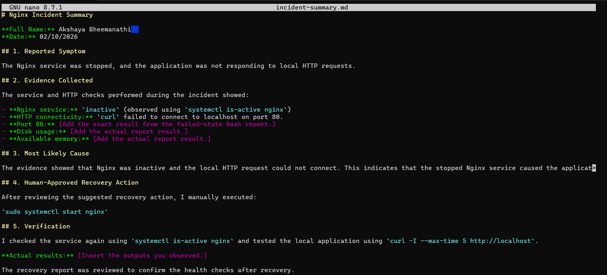

---

### Notes

Answer the following in your own words:

**1. What action did you execute manually?**

Notes You Must Write (Very Important)
What action did you execute manually?
What evidence proves that the service recovered?
Why is the second triage run necessary?
What could go wrong if an AI agent automatically restarted every failed service?
In one sentence, explain the difference between using AI as a chatbot and using AI in this agentic workflow.

---

**2. What evidence proves that the service recovered?**

The command systemctl is-active nginx returning active proves that Nginx is running. The command curl -I --max-time 5 http://localhost returning HTTP 200 OK proves that the application is responding to local HTTP requests. The recovery report should also show no failed checks.

---

**3. Why is the second triage run necessary?**

The second triage run verifies that the recovery action worked and checks the current health of Nginx, port 80, HTTP connectivity, disk usage, and available memory. It provides fresh evidence that the system has returned to a healthy state or identifies any remaining issues.

---

**4. What could go wrong if an AI agent automatically restarted every failed service?**

An automatic restart could interrupt active users, cause data loss, hide the real root cause, or make an incident worse if the service is failing because of a configuration or resource problem. Human approval helps ensure recovery actions are safe and appropriate.

---

**5. In one sentence, explain the difference between using AI as a chatbot and using AI in this agentic workflow.**

A chatbot mainly responds to questions, whereas an agentic AI workflow gathers real system evidence, analyzes it, recommends actions, and allows a human to approve and perform recovery.

---

# Incident Summary

Fill in all seven sections below in your own words.

**Full Name:** Akshaya Bheemanathi

**Date:** 02/10/2026

---

**1. Reported Symptom**

The Nginx service was stopped, and the website was not opening on localhost. The browser or HTTP request could not connect to the server.

---

**2. Evidence Collected**

Nginx service status showed inactive.

The curl -I --max-time 5 http://localhost command returned a connection error.

Port 80 was not accepting connections.

The Bash triage script was used to collect the server's health information and generate a report.

---

**3. Most Likely Cause**

The most likely cause was that the Nginx service had been stopped. Since Nginx was inactive, it was not listening for HTTP requests, making the application unavailable locally.

---

**4. Human-Approved Recovery Action**

After reviewing Claude's recovery recommendation, I manually executed the following command:

sudo systemctl start nginx

This started the Nginx service and was performed manually with human approval.

---

**5. Verification**

I verified the service using systemctl is-active nginx, which returned active. I also used curl -I --max-time 5 http://localhost to check the HTTP response. The expected successful response was HTTP 200 OK. I ran the /linux-triage skill again to generate a recovery report and check the system's health.

---

**6. Safety Decision**

The AI skill was allowed to gather and analyze system evidence but was not allowed to restart Nginx or modify the server. This ensured that the recovery action was reviewed and approved by a human operator before execution, reducing the risk of unintended changes.

---

**7. Agentic Loop Mapping**

Gather: The Bash script collected Nginx service status, port 80, HTTP response, disk usage, and available memory.

Analyze: Claude read the health report, identified the failed checks, and recommended a recovery command.

Human Act: I reviewed the recommendation and manually started Nginx.

Verify: I checked the service status, tested the HTTP response, and ran the triage skill again to confirm recovery.

---

# LinkedIn Post (Required)

## Evidence

#### LinkedIn Post URL

Paste your LinkedIn post URL here:

https://lnkd.in/p/dVg3Jqgd

---

#### Screenshot — Published LinkedIn post

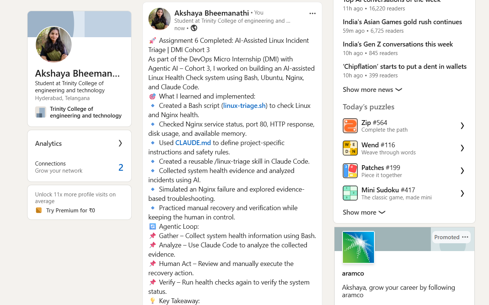

---

# GitHub Repository URL

Paste the URL of your GitHub folder or repository containing the assignment files here:

https://github.com/Akshaya-94402/devops-micro-internship-akshaya/blob/main/week-03-linux-and-bash-for-devops/assignment-06-ai-assisted-linux-health-check.md

---

# Submission Instructions

- Add all required screenshots in your submission
- Full Name must be visible in required screenshots and the Bash report
- All written answers must be in your own words
- Do not expose sensitive information (keys, passwords, AWS account IDs, tokens)
- GitHub URL must be included in this document

---

# Completion Checklist

- [✅] Task 1: Healthy baseline confirmed, workspace created (Screenshots 1–2, Notes answered)
- [✅] Task 2: CLAUDE.md created with all four sections (Screenshot 3, Notes answered)
- [✅] Task 3: Five-check plan produced by Claude using read-only tools (Screenshot 4, Notes answered)
- [✅] Task 4: `linux-triage.sh` created, syntax validated, executable permission set (Screenshots 5–8, Notes answered)
- [✅] Task 5: Healthy-state report generated with no FAIL result (Screenshots 9–10, Notes answered)
- [✅] Task 6: `/linux-triage` skill created and run successfully on healthy server (Screenshots 11–12, Notes answered)
- [✅] Task 7: Nginx incident simulated, failed evidence captured, Claude did not execute recovery (Screenshots 13–15, Notes answered)
- [✅] Task 8: Nginx recovered manually, recovery verified, reports saved, incident summary complete (Screenshots 16–19, Notes answered)
- [✅] Incident summary contains all seven required sections
- [✅] LinkedIn post published and URL submitted
- [✅] Full Name visible in all required screenshots and the Bash report
- [✅] Skill does not have Write permission
- [✅] Skill did not execute any recovery commands
- [✅] No sensitive data exposed

---

## 📌 About DMI & CloudAdvisory

DevOps Micro Internship (DMI) is a project-based DevOps program run by Pravin Mishra (The CloudAdvisory) focused on real-world execution, systems thinking, and career readiness.

It helps learners build strong DevOps foundations with hands-on experience.

---

## 📌 Resources

- 🌐 DMI Official Website: https://dmi.pravinmishra.com?utm_source=github&utm_medium=readme  
- 🎓 University: https://university.pravinmishra.com?utm_source=github&utm_medium=readme  
- 💬 Discord Community: https://discord.pravinmishra.com?utm_source=github&utm_medium=readme  
- 📝 Blog: https://dmi.pravinmishra.com/blog?utm_source=github&utm_medium=readme  
- ▶️ YouTube Playlist: https://www.youtube.com/playlist?list=PLFeSNDtI4Cho  
- 🔗 Pravin Mishra (LinkedIn): https://www.linkedin.com/in/pravin-mishra-aws-trainer/  
- 🏢 CloudAdvisory (LinkedIn): https://www.linkedin.com/company/thecloudadvisory/

---

*This submission is part of DevOps Micro Internship (DMI) — Agentic AI Track.*