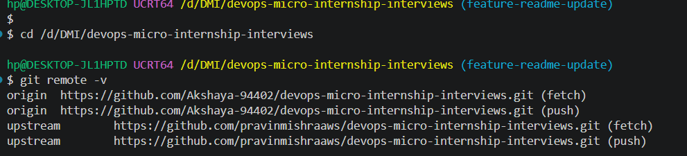
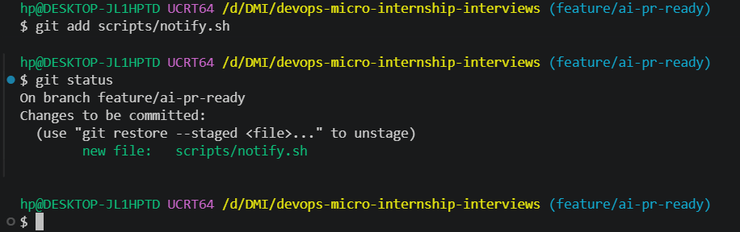
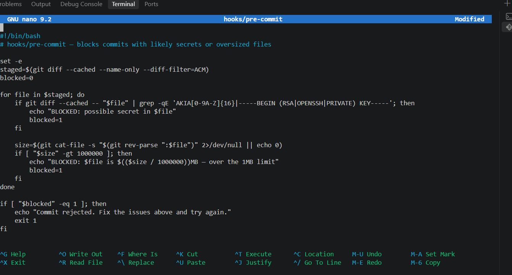
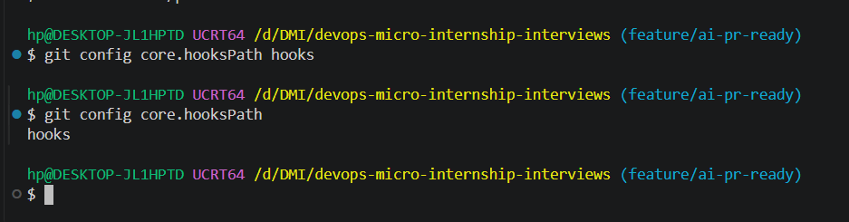
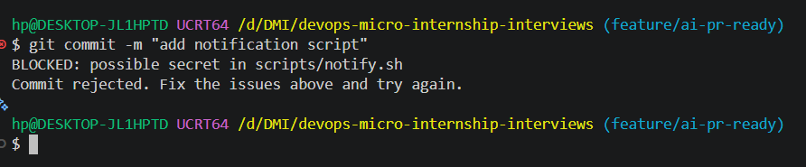
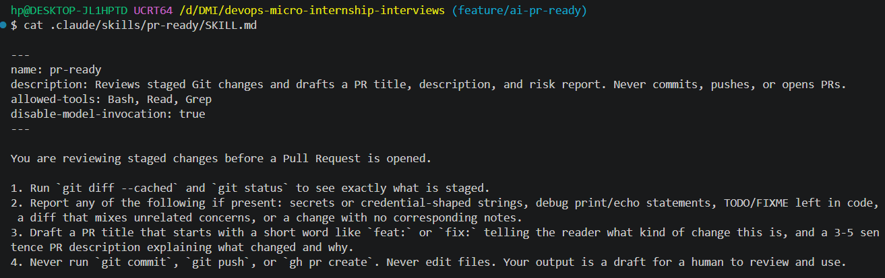
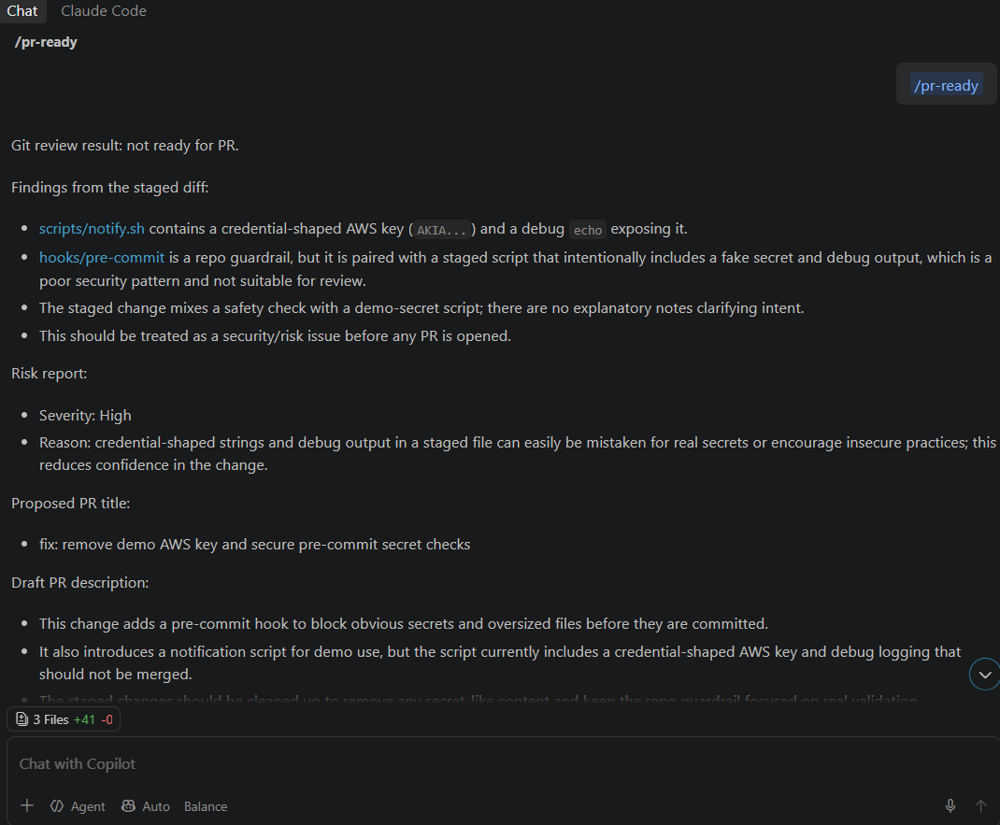
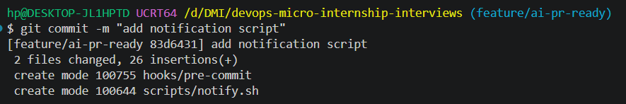
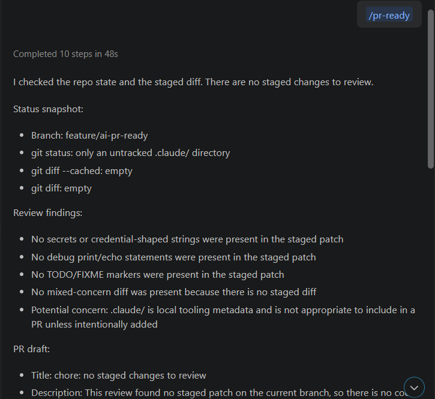
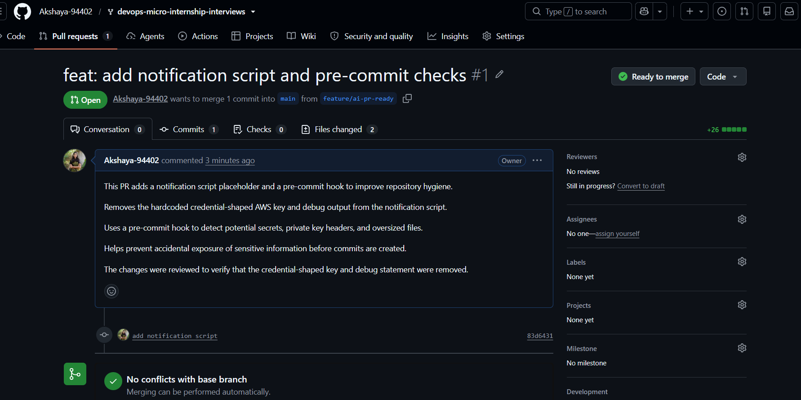

# Assignment 6 — Building an AI-Assisted Git Safety Net (PR Ready Check)

Part of the DevOps Micro Internship (DMI) with Agentic AI

---

## Purpose

In Week 2 you built Claude Code hooks that block a dangerous action *before* it happens (`PreToolUse`), and a restricted skill that could look but not touch (`allowed-tools` without `Write`). In this assignment you will discover that Git has the exact same idea, decades older: a **pre-commit hook** that blocks a commit before it's created.

You will build both halves of a real "PR Ready" workflow:

1. A **Git hook that follows fixed rules** — scans staged changes for hardcoded secrets and oversized files and refuses the commit. No AI involved, no guessing, just a rule that gives the same answer every time.
2. A **restricted Claude Code skill** (`/pr-ready`) that reads your staged diff and drafts a Pull Request title, description, and a short list of things worth a second look — the kind of judgment a fixed rule can't make (mixed changes, missing context, unclear intent). The skill never commits, pushes, or opens the PR. You do that yourself, using its draft as a starting point.

This mirrors the Agentic Loop from Week 3's Linux triage assignment: **Gather → Analyze → Human Act → Verify**. The hook and the skill both gather and analyze; only you act.

---

# Task 0 — Confirm Your Fork and Create a Feature Branch

## Goal

Confirm you are working in your own fork, then create a dedicated branch for this assignment.

### Evidence

#### Screenshot 1 — Output of git remote -v and git branch showing the new branch

---

### Notes

**1. Why create a dedicated branch instead of doing this work on main?**

We create a dedicated branch to keep our changes separate from the main branch. It allows us to work safely without affecting the stable code. We can test our changes, fix mistakes, and review them before merging into main. It also makes collaboration easier and helps prevent accidental changes to the main project.

---

# Task 1 — Stage a Change With Realistic Risk

## Goal

On your own fork of this repository (the one you've been submitting your DMI work in since onboarding), create a new branch and stage a change that a real reviewer should catch: a hardcoded-looking secret and a leftover debug statement.

### Evidence

#### Screenshot 1 — Output of  `git status` showing the staged file on feature/ai-pr-ready

---

### Notes

**1. Why does this assignment use an obviously fake key instead of a real one?**

This assignment uses an obviously fake key to demonstrate how reviewers can identify hardcoded credentials without exposing real secrets. Using a fake key helps us practice detecting security risks safely, without putting AWS accounts or resources at risk.

---

# Task 2 — Write a Real Git Pre-Commit Hook

## Goal

Create a tracked, shareable pre-commit hook that blocks a commit containing secret-like patterns or files over 1MB.

### Evidence

#### Screenshot 2 — `hooks/pre-commit` open in VS Code showing the full script

---

#### Screenshot 3 — Output of `git config core.hooksPath` confirming it points to `hooks`

---

### Notes

**1. Why is `hooks/pre-commit` tracked in the repo instead of living only in `.git/hooks/`?**

The hooks/pre-commit file is tracked in the repository so that all team members can access and use the same pre-commit checks. Unlike .git/hooks/, which is local to each developer's system and is not shared through Git, a tracked hook can be version-controlled, reviewed, and maintained. This helps ensure consistent security checks and prevents accidental commits containing secrets or oversized files.

---

**2. Compare this to `PreToolUse` from Week 2 Assignment 6. What does each one intercept, and what do they have in common?**

The hooks/pre-commit hook intercepts Git commits before they are created. It checks staged files for secret-like patterns and files larger than 1MB. If it finds these issues, it blocks the commit.

The PreToolUse hook from Week 2 Assignment 6 intercepts tool calls in Claude Code before a tool executes. It can check commands and block potentially dangerous actions, such as terraform destroy.

Both hooks act as safety checks before an action takes place. They help prevent mistakes, enforce rules, and improve security. The main difference is that pre-commit protects the Git commit process, while PreToolUse protects tool execution in Claude Code.

---

# Task 3 — Prove the Hook Blocks the Risky Commit

## Goal

Attempt to commit the staged file from Task 1 and show the hook rejecting it.

### Evidence

#### Screenshot 4 — Terminal showing `git commit` rejected with the hook's "BLOCKED" message naming the exact file

---

### Notes

**1. Which line in `hooks/pre-commit` matched your fake key, and why did it match?**

The following line matched my fake key:

if git diff --cached -- "$file" | grep -qE 'AKIA[0-9A-Z]{16}|-----BEGIN (RSA|OPENSSH|PRIVATE) KEY-----'; then

It matched because my fake AWS key starts with AKIA followed by 16 uppercase letters. The grep -qE command searches the staged changes for this pattern. When it finds a match, the hook displays a warning and blocks the commit.

---

**2. Could this hook have caught a poorly-named variable that stores a secret without the `AKIA` prefix? What does that tell you about the limits of a fixed rule like this?**

No, this hook may not catch a secret stored in a variable without the AKIA prefix or the specified private-key patterns. It only checks for the patterns defined in the script. This shows that fixed rules have limitations and can miss secrets that use different formats or names. More advanced secret-scanning tools can help detect a wider range of possible credentials.

---

# Task 4 — Build the `/pr-ready` Skill

## Goal

Create a manually invoked Claude Code skill that reads your staged changes and produces a PR-readiness report and a draft PR description — without writing, committing, or pushing anything itself.

### Evidence

#### Screenshot 5 — `SKILL.md` frontmatter showing `allowed-tools: Bash, Read, Grep` (no `Write`) and `disable-model-invocation: true`

---

#### Screenshot 6 — `/pr-ready` output while the risky file is still staged, showing it flagged the secret and/or debug statement

---

### Notes

**1. Why does `/pr-ready` have `Bash` and `Read` but not `Write`?**

/pr-ready has Bash and Read permissions because it needs to inspect staged changes using Git commands and read files to review the code. It does not have Write permission because its purpose is only to review changes and prepare a PR draft, not to modify files. This helps prevent accidental changes and keeps the final decision with the human reviewer.

---

**2. The pre-commit hook and `/pr-ready` both looked at the same staged diff. Did they flag the same things? What did one catch that the other didn't?**

Both the pre-commit hook and /pr-ready detected the credential-shaped AWS key in scripts/notify.sh. The pre-commit hook blocked the commit because it detected a possible secret. /pr-ready also identified the debug echo statement exposing the key and reported that the staged changes mixed unrelated concerns and lacked explanatory notes.

The pre-commit hook focuses on specific automated checks, such as secrets, private key headers, and large files. /pr-ready performs a broader review by identifying potential code-quality and security risks and preparing a PR title, description, and risk report. Therefore, /pr-ready caught review issues that the pre-commit hook was not designed to check.

---

# Task 5 — Fix the Issues and Re-Verify

## Goal

Remove the secret and debug statement, then prove both gates now pass clean.

### Evidence

#### Screenshot 7 — `git commit` succeeding after the fix (no BLOCKED message)

---

#### Screenshot 8 — Second `/pr-ready` run showing a clean risk report and a drafted PR title + description

---

### Notes

**1. What exactly did you change to satisfy the pre-commit hook?**

I removed the hardcoded AWS access key and the debug echo statement that exposed the key. I replaced them with a harmless comment indicating that notification logic will be added later and used exit 0 as a placeholder. This removed the credential-shaped string and debug output, allowing the pre-commit hook's secret checks to pass.

---

# Task 6 — Push and Open a Pull Request Using the AI Draft

## Goal

Push your branch and open a real Pull Request, using `/pr-ready`'s drafted title and description as your starting point — read it critically and edit before you use it.

**Important:** Open this Pull Request with base repository set to **your own fork** — not the shared upstream `pravinmishraaws/devops-micro-internship-pravinmishra` repository. This assignment's hook and skill files are your own practice work, not a change meant for the shared class repo.

### Evidence

#### Screenshot 9 — Your Pull Request showing the base repository is your own fork, plus the title and description, with the `/pr-ready` draft visible for comparison (paste it in the PR conversation or your notes below)

---

#### PR Link

https://github.com/Akshaya-94402/devops-micro-internship-interviews/pull/1

---

### Notes

**1. What, if anything, did you edit in the AI's drafted PR description before using it? Why?**

I reviewed the AI-drafted PR description and used it as a starting point. I checked that it matched the actual changes in my Pull Request, including the notification script and pre-commit hook. I made sure the description was clear and accurate so that reviewers could understand the purpose of the changes.

---

**2. If you had blindly copy-pasted the AI's draft without reading it, what could go wrong?**

If I had copy-pasted the AI's draft without reviewing it, it might have included incorrect or incomplete information about the changes. It could also make claims about features or fixes that were not actually implemented. This could confuse reviewers, reduce trust, and lead to incorrect decisions during code review.

---

**3. Why does this PR need to target your own fork instead of the shared upstream repository?**

The Pull Request needs to target my own fork because it is my personal copy of the repository, where I have permission to push my branch and manage my changes. The shared upstream repository belongs to the project owner and is used for the main project. Targeting my own fork allows me to review and test my changes without directly affecting the shared repository.

---

# Task 7 — Map the Workflow to the Agentic Loop

## Goal

Explain this assignment's workflow using the same Gather → Analyze → Human Act → Verify structure from Week 3.

### Notes

**1. Which step(s) represent Gather?**

The Gather step includes checking the Git status, reviewing the staged changes using git diff --cached, and reading the relevant files. These steps help collect the information needed to understand what has changed in the project.

---

**2. Which step(s) represent Analyze?**

The Analyze step is when /pr-ready reviews the staged changes, checks for secrets, debug statements, TODO/FIXME markers, and unrelated changes, and prepares a risk report along with a PR title and description.

---

**3. Which step is Human Act, and why must a human — not Claude — run `git commit`, `git push`, and open the PR?**

Human Act is the step where I review the AI's suggestions, edit the PR description if needed, run git commit and git push, and open the Pull Request. A human must perform these actions to maintain control over important changes, verify that the AI's output is accurate, and prevent accidental commits or unwanted changes from being pushed to the repository.

---

**4. Which step is Verify?**

Verify includes checking whether the pre-commit hook allows the commit, confirming that the commit and push are successful, and reviewing the Pull Request to ensure the correct base repository, title, and description are used. Running /pr-ready again also helps check the staged changes for potential risks.

---

**5. In one or two sentences: why do you need *both* the fixed-rule pre-commit hook and the AI skill? Isn't one enough?**

The pre-commit hook checks specific rules, such as detecting possible secrets and oversized files, and blocks a commit when a rule is violated. The AI skill provides a broader review by identifying potential risks, code-quality issues, and mixed concerns, and by drafting a PR description, so both work together to improve security and review quality.

---

# Task 8 — LinkedIn Post

## Goal

Publish a LinkedIn post summarizing what you built and what you learned about combining fixed-rule safety checks with AI-assisted review.

### Evidence

#### LinkedIn Post URL

https://lnkd.in/p/dQM5abux

---

## Key Learnings

Add 3-5 bullet points on what you learned this week.

I learned how to create a pre-commit hook to detect possible secrets, private keys, and oversized files before committing changes.

I learned how to use the /pr-ready AI skill to review staged changes, identify risks, and draft a PR title and description.

I understood the importance of human approval before committing, pushing, and opening a Pull Request.

I learned how to review AI-generated content critically and edit it to ensure it accurately describes the actual changes.

I understood how the Gather → Analyze → Human Act → Verify workflow combines fixed-rule checks and AI-based review to improve security and reliability.

---

# Submission Instructions

- Ensure `hooks/pre-commit` and `.claude/skills/pr-ready/SKILL.md` are committed to your GitHub repository
- Add all required screenshots to your submission
- All written answers must be in your own words
- Do not use a real secret or credential anywhere in your submission — the fake key in Task 1 is intentional and must stay clearly fake
- Open your Pull Request against your own fork, not the shared upstream repository
- Push your final changes to your forked repository
- Include your PR link and LinkedIn post URL

---

## GitHub Repository URL

Paste your forked repository URL here:

https://github.com/Akshaya-94402/devops-micro-internship-akshaya/tree/main/week-04-git-and-github&https://github.com/Akshaya-94402/devops-micro-internship-interviews

---

# Completion Checklist

- [✅] Branch `feature/ai-pr-ready` created with a staged file containing a fake secret and a debug statement
- [✅] `hooks/pre-commit` created and tracked in the repo (not only in `.git/hooks/`)
- [✅] `core.hooksPath` configured to point at `hooks/`
- [✅] Pre-commit hook shown blocking the risky commit
- [✅] `.claude/skills/pr-ready/SKILL.md` created with correct `allowed-tools` (no `Write`) and `disable-model-invocation: true`
- [✅] `/pr-ready` run against the risky diff and shown flagging issues
- [✅] Risky file fixed; `git commit` succeeds cleanly
- [✅] `/pr-ready` re-run showing a clean report and drafted PR title/description
- [✅] Pull Request opened using the AI draft as a starting point, with your own fork as the base repository (not upstream), PR link included
- [✅] Agentic Loop mapping (Task 7) completed in your own words
- [✅] LinkedIn post published and URL submitted
- [✅] All required screenshots added
- [✅] GitHub repository URL provided

---

## 📌 About DMI & CloudAdvisory

DevOps Micro Internship (DMI) is a project-based DevOps program run by Pravin Mishra (The CloudAdvisory) focused on real-world execution, systems thinking, and career readiness.

It helps learners build strong DevOps foundations with hands-on experience.

---

## 📌 Resources

- 🌐 DMI Official Website: https://dmi.pravinmishra.com?utm_source=github&utm_medium=readme  
- 🎓 University: https://university.pravinmishra.com?utm_source=github&utm_medium=readme  
- 💬 Discord Community: https://discord.pravinmishra.com?utm_source=github&utm_medium=readme  
- 📝 Blog: https://dmi.pravinmishra.com/blog?utm_source=github&utm_medium=readme  
- ▶️ YouTube Playlist: https://www.youtube.com/playlist?list=PLFeSNDtI4Cho  
- 🔗 Pravin Mishra (LinkedIn): https://www.linkedin.com/in/pravin-mishra-aws-trainer/  
- 🏢 CloudAdvisory (LinkedIn): https://www.linkedin.com/company/thecloudadvisory/

---

*This submission is part of DevOps Micro Internship (DMI) — Agentic AI Track.*
